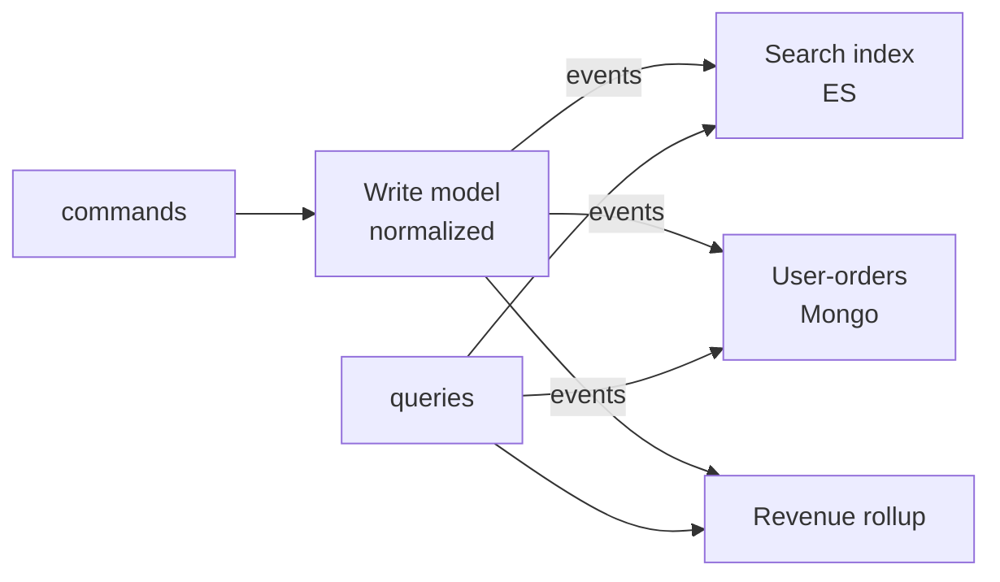

# CQRS and materialized read models

## 1. TL;DR

**CQRS** — Command Query Responsibility Segregation — splits the model used for writes from the model(s) used for reads. Writes go through a normalized, invariant-enforcing store; reads come from one or more **materialized read models**, each denormalized to a specific query shape and kept fresh by projecting events from the write side. The win shows up when read and write shapes genuinely diverge: a write model of `{order, line_items, customer}` is hostile to "search orders by free-text product name" or "yesterday's revenue by region." Build a read model per query; rebuild from scratch when you need to. The cost is eventual consistency plus more pipelines to operate. CQRS is most often deployed *without* event sourcing — that is a separate, more expensive decision.

## 2. How it works

### Command and query sides

The write side ("command side") owns business invariants. `PlaceOrder` hits an aggregate, validates, commits to Postgres in 3NF (`orders`, `order_items`, `addresses`, `customers` with foreign keys), emits an event. **The schema is shaped to prevent bad states**, not to answer queries.

The read side is one or more stores **shaped to a specific query**. Take "all orders shipped to ZIP 94110 in the last 7 days, sorted by line-item total descending." On the normalized write side that is a 4-way join (`orders × order_items × addresses × customers`), a sum aggregation, a sort, and at best a composite index nobody planned for. On a read side it is a single Elasticsearch document per order with `shipping_zip`, `created_at`, and a precomputed `total` field — the query is one term filter plus a range filter plus a sort, **O(log n) on indexed fields** instead of "scan and join."

The same write side can feed several read models in parallel: ES for search, a Mongo collection keyed by `customer_id` holding the user's last 50 orders pre-joined for the account page, a daily `revenue_by_region` rollup for the dashboard. None are good to write into; each is the right physical layout for exactly one read pattern.

### Projections

A **projection** is a consumer that reads the [event stream](pubsub-semantics.md) and updates a read store. Concretely: a Kafka consumer subscribed to `OrderEvents`, processing `OrderPlaced`, `OrderShipped`, `OrderCancelled`, denormalizing each into a `customer_order_search` Elasticsearch index keyed by `(customer_id, order_id)`. It is a pure function of `(current read state, event) -> new read state`, with two non-negotiable properties:

- **Idempotent.** Same event delivered twice produces the same read state. Track the last-applied event offset per projection (e.g. `(consumer_group, partition) -> offset` in a small Postgres table); on restart, ignore events at or below that offset.
- **Replayable.** Re-running from offset zero against an empty read store reaches the same final state. No "this event was applied at 3pm Tuesday" timestamps in the read model — only data derivable from the event itself.

### Replay — the killer feature

Replay is what justifies most of the cost. **Concrete scenario:** the projection has a bug — `OrderRefunded` events were double-counted into the daily revenue rollup for the past two months. You fix the consumer code, truncate the read store, reset the consumer-group offset to zero, restart. With **50M historical events** and a sustained projection throughput of **5k events/sec**, full replay takes `50M / 5k = 10,000s ≈ 2.8h`. Snapshotting the read state at hour boundaries (write the rollup table plus the offset to S3) lets the next replay start from the most recent snapshot instead of zero — **15 minutes** to catch up the last hour of events instead of 2.8 hours.

Adding a new read model nobody planned for at launch is the same mechanism: spin up a fresh consumer group on the same topic from offset zero, catch up against an empty read store, monitor lag until it converges with live, switch reads over. **No backfill, no touching the write side.** The event log already contains every fact; the new projection is just a new function over it. The read store is a [cache](caching.md).

### Event sourcing (the variant)

In the **without-event-sourcing** form — the common case — events are a side-effect of writes. The shape in the wild: the app `INSERT`s into `orders` in Postgres, **Debezium** tails the WAL and publishes change events to a Kafka topic, an **ES projection consumer** reads the topic and upserts denormalized documents into Elasticsearch. There is no `event_store` table; the row in `orders` is the source of truth, and the Kafka stream is a derived view of WAL changes. Lose Kafka, rebuild it by re-snapshotting the database through Debezium.

In **event sourcing**, events *are* the source of truth. The write model itself is a projection: to load aggregate state, fold over its events. No row in `orders` to read directly; there is `order_events` and a function. The write database, if any, is a cache.

That buys you a perfect audit log (events *are* the history) and the ability to derive any past state by replaying to a point in time. **The cost is that there is no `UPDATE`.** To fix a typo in a customer name, you do not run `UPDATE customers SET name = 'Smith' WHERE id = 42` — you publish a `CustomerNameCorrected` event, and every projection has to know how to fold it. Schema migrations are events. There is no admin panel that edits a row, because there is no row. Every aggregate load on the write side pays a fold over its event stream, partially mitigated by snapshots but never eliminated. **Only worth it when audit IS the business** — banking ledgers, trade clearing, regulated finance.

CQRS and event sourcing are orthogonal: CQRS is the read/write model split, event sourcing is events-as-source-of-truth. You can do either without the other. **CQRS without event sourcing is the common production shape** — outbox + CDC pushes events from a normal database into read models. Event sourcing without CQRS is rare and usually a mistake: if every read folds events, you nearly always want denormalized read models alongside.

## 3. When to use

- **Read and write shapes genuinely diverge.** Write a normalized order with line items and a customer FK; read "free-text search across order contents" or "this user's last 50 orders pre-joined." Forcing those reads through the normalized model means **joins on every page load and ad-hoc indexes that fight each other**.
- **Multiple read models from one source** — search index, customer-facing history view, analytics rollup. One write side feeding several independently-scaled read sides is exactly what CQRS is for.
- **Read:write ratio so skewed that read scaling needs different storage.** Reads dominate by 100x or more; the right answer is a store engineered for reads (Elasticsearch, denormalized cache, column store), not bigger replicas of the OLTP database.
- **Audit and temporal queries** ("what did this order look like on March 14?") — the event-sourcing case specifically.

Anti-signals:

- **Plain CRUD with read/write parity.** If reads are "show me the row I just wrote," CQRS is overhead with no payoff.
- **Strong consistency required between write and read.** CQRS is asynchronous — the read side trails by at least the projection lag, the same shape as [replication lag against a follower](replication.md). If "the next read after a write must reflect that write," handle read-your-writes explicitly (sticky-route to write, optimistic UI), don't paper it with a read-model lookup.
- **Small teams on small systems.** Two stores, an event pipeline, and projection monitoring is real operational weight; a single Postgres serves a startup for years.

## 4. Trade-offs and failure modes

- **Eventual consistency between write and read.** The headline cost, and the failure is usually a UX bug, not a data bug. **Concrete:** user clicks "Place order", the write commits to Postgres, the user is redirected to `/orders/12345`. That page reads from the ES projection — which is **200ms behind** because the projection consumer is processing a small backlog. Page renders "order not found." User clicks again, places a duplicate. Mitigations, in increasing complexity: **optimistic UI** (render the confirmation page from the response payload of the write, not a re-fetch); **session-sticky read-your-writes** to the write side for the first N seconds after a write; **LSN-aware reads** where the client passes the write's commit LSN/offset and the read side blocks until its projection has caught up to that point. Pretending the lag does not exist is the most common production failure mode.
- **Replay cost grows linearly with event count.** Cold replay of a year-old log is hours; for systems past 100M events it is **a day or more** at typical projection throughput. Snapshotting (periodic dumps of read state plus offset, e.g. hourly) cuts cold-replay from "outage-grade" to "long lunch." Without it, projection recovery is a real RTO metric. **Test replay regularly** — a path nobody has run in two years no longer works.
- **Event schemas are permanent.** Old events live forever; every projection must handle every historical version. You add new event shapes, never delete. [Versioning discipline](schema-evolution.md) — additive changes only, version field, upcasters from v1 into v2 on read — is non-optional.
- **Projection bugs require replay, not hotfixes.** Truncate, fix, replay. Any "fast fix that patches the read store directly" **rots the replay invariant**: the next replay reverts the patch and the bug is back. The temptation is high under incident pressure; resist it or annotate the patch as an event the projection can re-apply.
- **Operational complexity.** Multiple stores, an event pipeline (Kafka, outbox + CDC), projection workers, snapshot jobs, offset tracking, lag monitoring, replay tooling. Make sure the read-shape divergence justifies that surface area.
- **Event sourcing's specific tax.** Every change is an event; ad-hoc DB fixes are not available. Migrations are events (a `CustomerNameCorrected` event, not an `UPDATE`). No admin tool changes a row because there is no row to change. Loading current state pays the fold cost, partially solved by snapshots but never fully.

## 5. Real-world and interviewer probes

The most common form of CQRS in production is **Elasticsearch as a read model over a relational write store**. Postgres or MySQL holds the authoritative records; outbox + Debezium or a service-side projection pushes documents into Elasticsearch shaped for the product's search queries. **Nobody on the team calls it "CQRS." It is exactly CQRS.** Denormalized DynamoDB tables fed from a transactional write side, and analytics warehouses pulling from CDC into a star schema, are variants on the same idea.

Banking ledgers and trade-clearing systems are the canonical event-sourced production example — events as the source of truth because the audit log *is* the business. **EventStoreDB** and **Axon Framework** are dedicated event-sourcing tools; **Kafka with compacted topics** is sometimes pressed into the role.

Probes you should expect:

- *"When is CQRS a mistake?"* — Plain CRUD with read/write parity, small teams, no divergence between read and write shape. Two stores plus a pipeline buys nothing if one table answered the queries.
- *"How do you handle eventual consistency in the UI?"* — Optimistic update showing new state immediately, reconcile on the next refresh. For critical "did this happen?" reads, route the post-write read back to the write store via session affinity.
- *"Why event sourcing on top of CQRS?"* — Audit, time-travel debugging, and the freedom to derive future read models without re-querying the write store. The cost: every change is an event, ad-hoc updates gone, migrations become events, snapshots non-optional once counts grow.
- *"How do you add a new read model after launch?"* — New projection on the existing log from offset zero, catch up against an empty read store, monitor lag until it converges with live, switch reads over. No backfill, no touching the write side.
- *"What goes wrong in production?"* — Projection lag spikes nobody alerts on, schemas that drifted because a v3 field wasn't handled by the v1 projection, a replay path that bit-rotted because nobody ran it in two years, and patching the read store directly to fix a number — which works until the next replay reverts it.
