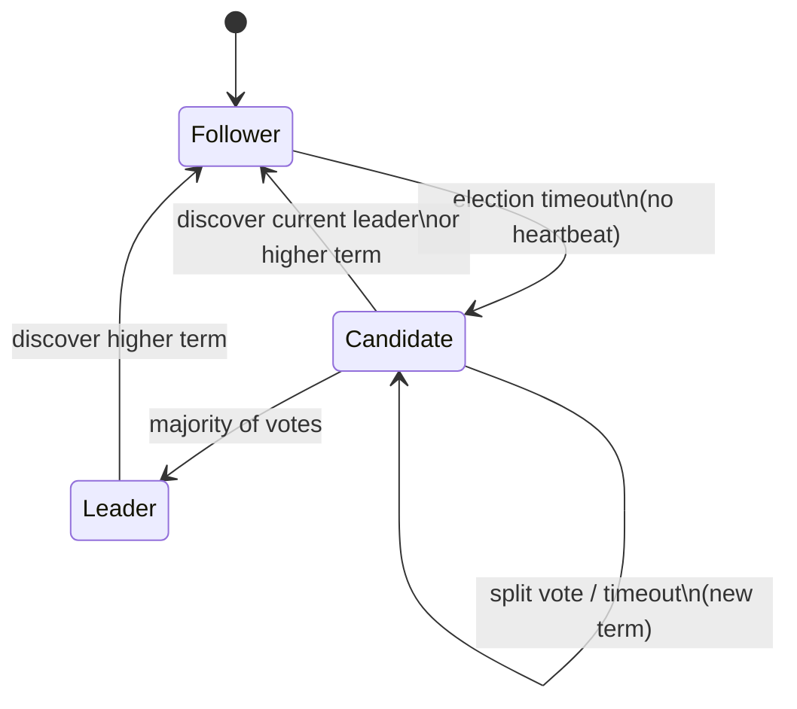
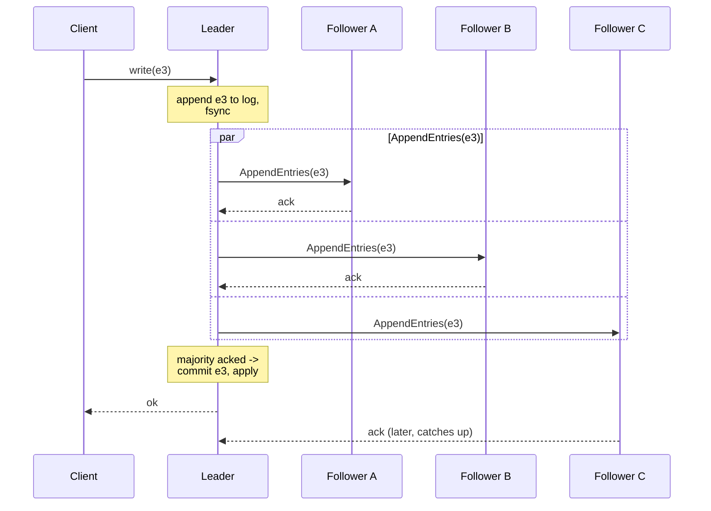

# Leader election and consensus

## 1. TL;DR

**Consensus** protocols — Raft, Paxos, Multi-Paxos, EPaxos — let a cluster agree on a single ordered log of operations despite crashes, slow links, and partitions. **Leader election** is the most common building block on top: agreeing "who's in charge" so operations serialize through one node. The engineering question is whether you actually need consensus at all. **Every commit costs a majority round trip plus an fsync, and a single leader is the throughput ceiling** — reach for it only when one global ordering of events is a hard requirement. Workloads that tolerate eventual consistency should skip the tax and use [quorum replication](quorum-consistency.md) instead.

## 2. How it works

### Raft, the readable one

If you remember one consensus protocol, remember Raft. It exists because Paxos is correct but unreadable, and unreadable protocols become buggy implementations. Raft splits the problem into clean sub-problems: leader election, log replication, and safety.

A Raft cluster has `N` nodes (typically 3 or 5). Each node is **follower**, **candidate**, or **leader**. Time is divided into **terms** — monotonically increasing integers, at most one leader per term. A node persists `currentTerm`, `votedFor`, and its log to disk before responding to any RPC.



### Election

Walk a 5-node cluster (A, B, C, D, E) booting fresh. All start as **followers** in `term = 1` with no leader. Each picks a **randomized election timeout** in `[150, 300] ms` — randomness is the only thing that breaks symmetry. Say A's timeout fires first at 187 ms with no heartbeat received. A transitions to **candidate**, **increments `currentTerm` to 2**, votes for itself, persists `(currentTerm=2, votedFor=A)` to disk, and sends `RequestVote(term=2, lastLogIndex, lastLogTerm)` to B–E.

Each peer receives the RPC, sees `term=2 > 1`, updates its own `currentTerm` to 2, checks that it has not yet voted in term 2 and that A's log is **at least as up-to-date** as its own (compare `(lastLogTerm, lastLogIndex)` lexicographically), and replies `voteGranted=true`. A collects 4 yes votes (plus its own = 5) — well past the **majority of 3 out of 5** — and becomes leader. It immediately broadcasts `AppendEntries` heartbeats to suppress further timeouts.

Two things to notice. **The randomized timeout is the tie-breaker** — without it, all five fire together, all become candidates in term 2, all vote for themselves, and no one wins. A split vote forces another randomized backoff and a new term (3). **The term number is the stale-leader weapon** — any RPC carrying a higher term forces the receiver to step down to follower; any RPC carrying a lower term is rejected with the receiver's current term so the sender catches up.

### Log replication

Walk a single client write to a stable cluster with leader L and followers F1–F4. Client sends `write(x=7)` to L.

1. L appends entry `e=(term=2, index=5, "x=7")` to its log. **Uncommitted.** L fsyncs.
2. L sends `AppendEntries(term=2, prevLogIndex=4, prevLogTerm=2, entries=[e], leaderCommit=4)` to F1–F4 in parallel.
3. Each follower checks the consistency invariant: my log at `prevLogIndex=4` has `prevLogTerm=2`. If yes, append `e`, fsync, reply `success=true`. If no, reply `success=false` — leader decrements `nextIndex` for that follower and retries with an earlier prefix until they match (this is how diverging logs converge).
4. F1 and F2 ack first. L now has the entry on **3 of 5 logs (itself + F1 + F2) — majority**. L marks index 5 **committed**, applies `x=7` to its state machine, returns `ok` to the client.
5. F3 and F4 ack later. They do not know index 5 is committed yet — they learn on the **next AppendEntries**, where `leaderCommit=5` tells them to apply through index 5.

The invariant that falls out: **same operations applied in the same order to deterministic state machines produce the same state on every replica** — state-machine replication. Latency-wise, the client waits for L's fsync plus one network round trip plus the **slowest** of the majority-minus-one followers' fsyncs. The two stragglers do not block the client.



### Safety

Two rules together guarantee **a committed entry is never overwritten**. The **election rule**: vote only for candidates whose logs are at least as up-to-date as your own — so any new leader already has every committed entry. The **commit rule**: a leader only commits entries from its own term once a majority has them — preventing a subtle case where a previous-term entry replicated to a majority could otherwise be overwritten by a later leader. Lagging followers catch up; diverging followers get their conflicting suffix overwritten by the leader.

### Quorum size

A cluster of `N` needs `⌊N/2⌋ + 1` alive to commit and therefore tolerates `⌊N/2⌋` failures. Walk the table:

```
N=3 → majority 2, tolerates 1 failure
N=4 → majority 3, tolerates 1 failure
N=5 → majority 3, tolerates 2 failures
N=7 → majority 4, tolerates 3 failures
```

**`N = 4` buys you nothing over `N = 3`**: same fault tolerance, one extra machine paying disk and network for every commit. Worse, a 2-2 partition kills `N = 4` outright, where the equivalent 1-2 split on `N = 3` still has a 2-node majority side that makes progress. **Step from odd to odd** (3 → 5 → 7) when you want more fault tolerance; never to an even size.

### Paxos, Multi-Paxos, EPaxos

**Paxos** (Lamport, 1989) is the original; single-decree Paxos agrees on one value through prepare/promise/accept/accepted phases. **Multi-Paxos** amortizes the prepare phase by electing a stable leader, so steady-state operation is one round trip per command — operationally similar to Raft, just less readable. **EPaxos** is leaderless: any replica acts as the command leader for its own proposals. Non-conflicting commands commit on the **fast path** in one RTT to the nearest fast-path quorum (roughly `⌈3N/4⌉`), so a client in any region pays only the latency to its closest replicas. Conflicting commands fall back to a **slow path** (a second RTT) and are ordered via a dependency graph at execution time. It pays off when commands rarely conflict and clients are geographically spread; under high conflict it degrades toward Multi-Paxos latency without the operational simplicity of a single leader.

## 3. When to use

Reach for consensus when:

- **You need a single coordinator.** Sequencer for global IDs, [lock service](distributed-locks.md), primary in a primary-replica DB, current-leader-of-shard. Leader election is the cheapest correct way.
- **You need strongly consistent metadata.** Cluster membership, configuration, schema, feature flags that must never diverge. Small data, low write rate — a perfect fit.
- **You need a replicated log / state machine.** Every replica applies the same operations in the same order. etcd, ZooKeeper, KRaft, the per-range groups in CockroachDB and Spanner.
- **You need linearizable reads.** Route reads through the leader's log or use leader leases.

Anti-signals — do not use consensus for:

- **High-throughput data plane.** Every commit is a majority round trip. Raft fits a coordination plane; it does not fit "every customer event goes through Raft." Shard the keyspace and run a Raft group per shard if you need to scale.
- **Workloads where eventual consistency is fine.** Feeds, social graphs, analytics, audit-style append. Use quorum replication and CRDTs and skip the consensus tax.
- **Cross-region critical-path writes you cannot afford tens of ms for.** Consensus across regions costs WAN RTT per commit; the answer is sharded leadership per region, not a single global Raft group.

## 4. Trade-offs and failure modes

- **Latency floor is one majority round trip plus fsync.** Each committed op = leader fsync (~1 ms on NVMe) + `AppendEntries` RTT to followers + the slowest majority-quorum follower's fsync. **Same-AZ commits land at ~3–5 ms; cross-region at ~50–100 ms**. Multiply by ops/sec to size your throughput envelope. This is exactly why control planes (etcd, KRaft, lock services) sit on Raft — low write rate, high consistency need — and **data planes do not**: 50 ms per write across regions is a non-starter for customer requests.
- **CP under partition.** Without a majority, the cluster makes no progress. The minority side is read-only at best (and only safely under a leader lease that has not expired). This is the price of strong consistency — pretending otherwise is split-brain.
- **Single-leader throughput cap.** All writes funnel through the leader. Disk fsync on the leader is the floor on commit latency. Group commit batches help; raising IOPS helps; **the only architectural escape is sharding into multiple Raft groups** (CockroachDB and Spanner do this — one Raft group per data range, tens of thousands of groups per cluster).
- **Stale-leader reads.** Walk the failure: leader L gets network-partitioned from F1–F4. F1–F4 do not hear heartbeats, time out, elect F1 leader in a new term. L still believes itself leader and **serves a local read of `x` to a client — but the client just wrote `x=8` to F1, who committed it via {F1,F2,F3} majority. The client reads the stale `x=7`.** Two mitigations. **Read-through-log:** L proposes a no-op entry; if it commits, L was leader the whole way through and the read is safe. Always correct, but costs a full majority round trip per read. **Leader leases:** L holds a time-bounded lease (say 10 s) confirmed by majority heartbeats; while the lease is unexpired, L serves local reads as linearizable. Followers promise not to elect a new leader until at least the lease duration after their last heartbeat from L. Faster, but assumes a bound on monotonic-clock drift between L and followers — if L's clock runs slow it may believe it still has lease time after F1 has already elected itself.
- **Cluster reconfiguration is its own protocol.** Walk why. Going from `{A,B,C}` to `{A,B,C,D,E}` with a naive single-step switch: at the moment of changeover, A and B (majority of `{A,B,C}` = 2) could elect one leader, while at the same moment A, D, and E (majority of `{A,B,C,D,E}` = 3) could elect a different leader. **Two leaders, same term, split-brain.** Raft's **joint consensus** fix: pass through an intermediate config `C_old,new` that requires a majority in **both** `{A,B,C}` and `{A,B,C,D,E}` for any decision. No subset of nodes can satisfy both old-majority and new-majority while excluding overlap, so split-brain becomes impossible. Operationally awkward and rarely well-tested in homegrown implementations — prefer battle-tested libraries.
- **Disk fsync dominates p99.** Every commit is durable on the leader before ack — a noisy-neighbor disk becomes a cluster-wide latency spike. Provision dedicated disks for consensus volumes.
- **Operational complexity.** Snapshots, log compaction, term and index invariants on disk — Raft is simpler than Paxos but still a real distributed system. Recovering from quorum loss is a fraught manual procedure.

## 5. Real-world and interviewer probes

In the wild: **etcd** and **Consul** use Raft for their coordination logs; Kubernetes is etcd-on-Raft underneath. **ZooKeeper** uses **Zab** — an atomic broadcast protocol with a single primary and a FIFO log per epoch, closer in shape to Raft than to classic Paxos despite the "Paxos-family" label. **Spanner** runs Paxos per data range to replicate writes synchronously across zones, layering TrueTime on top for external consistency. **CockroachDB** runs Raft per range — one cluster contains tens of thousands of small Raft groups. **Kafka KRaft** is a Raft-based metadata quorum that replaced ZooKeeper for cluster controllers. **HashiCorp Vault** uses Raft for its integrated storage backend.

Probes you should expect:

- *"Why is the cluster size usually odd?"* — A cluster of `N` tolerates `⌊N/2⌋` failures. `N = 4` tolerates 1 (same as `N = 3`) but costs an extra node and loses on a 2-2 partition. Odd sizes give you the most fault tolerance per replica cost.
- *"How does Raft elect a leader?"* — Followers run randomized election timeouts. On timeout, a follower becomes a candidate, increments its term, votes for itself, and asks peers for votes. First candidate to a majority wins. The randomized timeout breaks ties; the term number prevents stale leaders from acting after a partition heals.
- *"Why not put everything behind Raft?"* — Latency tax (every write is a majority round trip plus an fsync), throughput cap (single leader), and operational complexity. Use it only for things that genuinely need agreement on an ordering — coordination metadata, lock services, replicated state machines — not the customer-facing data plane.
- *"How do you do linearizable reads in Raft?"* — Two options. Route the read through the log: append a no-op, wait for it to commit on a majority, then read. Slow, always correct. Or use **leader leases**: the leader holds a time-bounded lease confirmed by majority heartbeats, and reads served while the lease is valid are linearizable. Faster, assumes bounded clock drift.
- *"Difference between consensus and quorum-based replication?"* — Consensus picks **one** ordering of commits; every replica agrees that operation X happened before Y. Quorum-based replication accepts concurrent writes at different coordinators and reconciles later via LWW, vector clocks, or CRDTs; replicas temporarily disagree on ordering and converge through read repair. Consensus buys strong consistency at the cost of latency and a single-leader bottleneck; quorum replication buys availability and throughput at the cost of conflict resolution.
