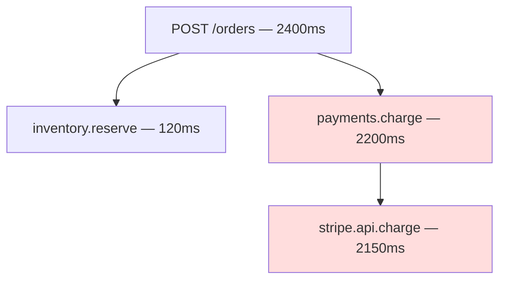

# Observability trio

## 1. TL;DR

Production observability is **metrics, logs, and traces run as one practice, glued by a propagated trace ID.** Metrics tell you *that* something is wrong, traces tell you *where* in the call graph time or errors went, logs tell you *why* a specific request misbehaved. The senior-level mental model: a p99 alarm fires from metrics → you click the bad histogram bucket and follow an exemplar into a representative slow trace → you see one span owns the time → you filter logs by that span's `trace_id` and read the actual error. Three tools, one investigation. Get the patterns right — RED/USE/Four Golden Signals for metric shape, structured JSON logs keyed on trace ID, W3C `traceparent` propagated through every hop including async, sampled tracing with exemplars — and you debug distributed systems without SSHing into anything.

## 2. How it works

The trio shares one operational invariant: **every event in every signal is correlatable to the originating user request via a propagated ID.** Lose that and you have three disconnected dashboards.

### Metrics — what shape to track

Metrics are aggregates over time. Three frameworks cover almost every case, complementary not competing:

- **RED** (per service/endpoint): **R**ate, **E**rrors, **D**uration. The service from the outside — what callers see.
- **USE** (per resource — CPU, disk, queue, pool): **U**tilization, **S**aturation, **E**rrors. The internal-capacity view.
- **Four Golden Signals** (Google SRE): **latency, traffic, errors, saturation.** A superset of RED with saturation; the canonical answer if an interviewer asks for one framework.

Aggregation rule: **histograms over averages.** A mean of 50ms with a p99 of 5s is a system where 1% of users are getting hurt and your dashboard says fine; the average drowns the tail in volume. Record histograms (Prometheus `histogram_quantile`, OTel explicit-bucket or exponential histograms) so you can read p50/p95/p99/p99.9 directly. The interesting failure modes — GC pauses, [slow downstreams](resilience-four-pack.md), queue backups — only appear above p99.

### Structured logging

Logs are key/value JSON, not text strings. Indexed in a log store (Elasticsearch, Loki, Splunk), queryable with a real query language, and *correlation-friendly* because every line carries trace ID, span ID, and request-scoped IDs as discrete fields. A JSON line `{"level":"ERROR","svc":"checkout","trace_id":"...","user_id":"u_8231","msg":"payment declined"}` is a row in a table filterable by any field; "ERROR: payment declined for user 8231" is not.

### Correlation IDs and W3C Trace Context

Every request gets a trace ID at the edge (LB, API gateway, ingress) and rides every downstream call as an HTTP header. Today's standard is W3C **`traceparent`**, a single header encoding version, trace ID, the current span ID, and the sampled flag:

```
traceparent: 00-4bf92f3577b34da6a3ce929d0e0e4736-00f067aa0ba902b7-01
              ^  ^                                ^                ^
              |  |                                |                sampled flag
              |  |                                parent span id (8 bytes hex)
              |  trace id (16 bytes hex)
              version
```

Walk one hop. Service A starts a request, generates trace ID `4bf9…4736` and span ID `00f0…02b7`, writes them on every log line, and sends `traceparent: 00-4bf9…4736-00f0…02b7-01` to service B over HTTP. B reads the header, generates a *new* span ID `b7ad…1f0c`, sets `parent_span_id = 00f0…02b7`, keeps the same trace ID, and propagates `traceparent: 00-4bf9…4736-b7ad…1f0c-01` further down. Same trace, parent-child link preserved, sampling decision honored.

**The chain is only as strong as its weakest link.** Any service that forgets to propagate the header breaks correlation for every downstream hop — silently, because logs still write, just without the ID. **Async boundaries are where this dies most often.** HTTP frameworks and service meshes (Envoy, Istio, OpenTelemetry SDKs) auto-propagate; Kafka, SQS, RabbitMQ, EventBridge do not. The producer must copy `traceparent` into Kafka message headers / SQS message attributes, and the consumer must read them back and start a new span under the same trace ID. OTel's messaging instrumentations do this for you; hand-rolled producers do not, and every async hop becomes a wall in the trace tree. **Enforce propagation at the framework / mesh level**, not in application code, or it will be forgotten.

### Distributed tracing

A trace is a tree of **spans**, one per logical operation, linked parent-to-child. The shape shows where time was spent and where errors originated.



The shaded path is where the latency lives: `payments.charge` owns the time, and almost all of it is in the outbound `stripe.api.charge` call. Without the tree you would only see "checkout is slow."

100% tracing is unaffordable at any real QPS — a span at ~1 KB times 10k QPS times average 8 spans per trace is ~80 MB/s of trace data per service before compression — so traces are **sampled**. The two strategies are not equivalent:

- **Head-based sampling.** At request start (the edge LB or first service), flip a biased coin and write the result into `traceparent`'s sampled flag. Every downstream service honors that flag — emit spans if sampled, drop them if not. Cheap (no buffering, no central collector), decentralized, and the decision is consistent across services so you never get half a trace. **The fatal weakness: errors are rare, and head-based is blind to them.** A 0.01% error rate at 1% sampling means you see ~1 error trace per million requests — at low traffic, you can go a whole incident without a single example trace of the failure you are paging on.
- **Tail-based sampling.** Every service emits 100% of spans to a collector layer (typically OTel Collector). The collector buffers the full trace until the root span closes — usually a few seconds — then runs a policy: **keep this trace if it errored, exceeded a latency threshold, touched a flagged endpoint; otherwise keep 1% as baseline**. Catches every error and every slow trace. Cost is real: every service emits every span (10–100x the network and CPU of head-based), and the collector needs enough memory to hold every in-flight trace. The collector also has to be sharded by trace ID so all spans of one trace land on the same instance.

In practice: **head-based for general services, tail-based or 100% retention for high-stakes flows** (payments, auth, checkout) where you cannot afford to lose the example. Honeycomb's "dynamic sampling" is a third approach — sample rate varies by event shape so common cases sample heavily and rare cases survive.

**Exemplars** are the bridge from metrics to traces: each histogram bucket stores a few trace IDs that landed in it. Click the p99 bucket, follow the exemplar, land in a representative slow trace. Aggregates surface the *problem*, exemplars route you to the *example*. This is what makes head-based sampling tolerable in practice — you only need *one* example trace per bucket, not all of them.

### Cardinality discipline

In a TSDB, **each unique combination of label values is a separate time-series** — its own index entry, its own in-memory chunk, its own WAL slot. Not a column on a shared row.

Walk the explosion. You have a metric `http_requests_total{service, endpoint, status}` with 1 service × 100 endpoints × 5 status codes = 500 series. Tractable. Someone adds `user_id` "to make per-user dashboards easier." With 10M users × 100 endpoints × 5 statuses, **the upper bound is 5 billion series**; in practice the active set is whatever users hit in the last few hours, but at 100k active users that is still 50M series. A typical Prometheus instance OOMs around 1–10M active series depending on RAM. **The mistake takes the cluster down within hours**, alerting goes blind during the outage it caused, and you discover it from PagerDuty rather than from a dashboard.

**Bound cardinality at instrumentation time.** Low-card on metric labels: `service`, `endpoint`, `status`, `region`, `tenant_tier`. High-card to logs and trace attributes: `user_id`, `request_id`, `session_id`, full URL, customer name. Lint metric definitions in CI — block any label whose values are user-supplied, IDs, or timestamps. Exemplars cover the gap when you need to drill in: a histogram bucket can carry a trace ID without exploding the metric, because the trace ID lives in the bucket's exemplar slot, not as a label dimension.

## 3. When to use

- **Any production system with more than one service.** A monolith can survive on logs and a process dashboard; the moment one network hop separates two pieces of business logic, you cannot answer "where did the time go" without traces.
- **Anything you will debug at 3 a.m.** If you cannot answer *is the system healthy, where is the latency, why did this request fail* from a dashboard before opening a terminal, observability is incomplete regardless of how many tools are installed.
- **Required for SLOs.** Error-budget math (target = 99.9%, budget burn rate, multi-window alerts) is mechanically derived from metrics; without histograms over success/failure you have no SLO, only an aspiration.
- **Required for capacity planning and incident review.** USE metrics (utilization, saturation) drive autoscaling and headroom decisions. Traces + logs reconstruct the post-incident timeline when memory has faded.

Anti-signals: a single-user prototype (stdout is fine); a cron that runs daily and writes one log line. There is no "production system, but skip observability" — that is the system where the 3 a.m. page comes with no dashboard to open.

## 4. Trade-offs and failure modes

- **Cardinality explosion is the classic Prometheus outage.** Walked above; the structural cure is to lint metric labels in CI, push high-card IDs to logs and trace attributes, and use exemplars for the metric→trace bridge.
- **Head-based sampling misses rare errors.** 1% sampling on a 0.01% error rate gives you ~1 example trace per million requests — at low QPS, the incident ends before you see an example. Tail-based or 100% retention for payments/auth/checkout.
- **Log volume cost dominates at scale.** Logging every request body can cost more than the application. Sample logs too: errors at 100%, successes downsampled, **PII redaction at the framework layer** (not per-call discipline, which is forgotten under deadline). Storage tiering — hot 7 days, cold to S3 after — is what keeps the bill survivable.
- **Async boundaries lose trace context.** Producer must copy `traceparent` into Kafka headers / SQS attributes, consumer must read it back. The single most common place trace trees break in microservices, because HTTP propagation works automatically and developers assume async does too. Use OTel's messaging instrumentation; verify the trace tree end-to-end before claiming tracing is working.
- **Alert on symptoms, diagnose with traces and logs.** Pages fire on user-facing signals: **SLO error-budget burn rate, customer-visible error rate, p99 latency**. These stay stable across refactors and only fire when users are actually hurt. Cause-based pages ("CPU > 80%", "queue depth > 1000") go stale the moment infra changes underneath, fire constantly during normal-but-noisy load, and train on-call to mute the pager. Traces and logs are the *diagnostic* layer you reach for *after* a symptom alert; they are not alert sources. The Google SRE rule of thumb: if the page does not correspond to something a user would notice, it should not be a page.
- **Vendor lock-in is fixable now.** Every stack historically had its own protocol. **OpenTelemetry** is the cure: vendor-neutral wire format (OTLP) and SDKs across all three signals. Instrument once in OTel, swap Datadog for Honeycomb by reconfiguring the collector — not the application.

## 5. Real-world and interviewer probes

In the wild, the canonical open-source stack is **Prometheus + Grafana** (metrics), **ELK / Loki / Splunk** (logs), and **Jaeger / Zipkin / Tempo** (traces). **Datadog**, **New Relic**, and **Honeycomb** sell the unified version — Honeycomb is built around high-cardinality event-style telemetry rather than pre-aggregated metrics. **OpenTelemetry** is the cross-vendor protocol and SDK suite: instrument once, ship anywhere. The **W3C Trace Context** spec defines `traceparent` / `tracestate` as the propagation standard. Google's **Dapper** paper (2010) is the original distributed-tracing design.

Probes you should expect:

- *"What are the four golden signals?"* — Latency, traffic, errors, saturation. RED is the same idea per-endpoint without saturation; USE is the resource-side view.
- *"Logs vs. metrics vs. traces — when?"* — Metrics for aggregates and alerting (cheap, low cardinality). Logs for arbitrary detail you didn't know you'd need (high cardinality, cheap to write, expensive to query). Traces for "where in the call graph did time go or this fail." Complementary, not substitutable.
- *"Why sample traces?"* — Cost. Storing 100% of traces at high QPS is unaffordable in any backend.
- *"Tail-based vs. head-based sampling?"* — Head-based decides at the edge (cheap, decentralized, may drop the rare error). Tail-based buffers the whole trace and decides at the end (keeps errors and slow traces, costs a centralized collector and buffer memory). Head-based by default; add tail-based for high-stakes services.
- *"How does cardinality blow up Prometheus?"* — Each unique label-value combination is a separate time-series consuming TSDB memory and an index slot. High-card labels (user ID, request ID, full URL) multiply series count without bound. Bound at instrumentation; push high-card to logs and trace attributes; use exemplars for the metric→trace bridge.
- *"Walk me through debugging a latency spike."* — Concrete: SLO burn-rate alert fires on `payments-api`, p99 jumps from 80 ms to 600 ms. Open the golden-signal dashboard — latency moved, traffic and error rate look normal-ish but errors ticking up. Click the p99 histogram's 500–1000 ms bucket, follow an exemplar trace ID. Trace tree shows `POST /charge → payments.charge → stripe.api.charge`, and `stripe.api.charge` owns 580 of the 600 ms. Filter logs by `trace_id` at the `payments` service: you see Stripe returning HTTP 503 with `X-Stripe-Outage: true`. **Root cause: Stripe outage, not your bug.** Three tools, one investigation, glued by trace ID. The flow is *metrics → exemplar → trace → logs by trace ID*; it only works if propagation held end-to-end.
- *"How do you keep trace context across a Kafka hop?"* — Producer copies `traceparent` (and `tracestate`) from the current span context into Kafka message headers; consumer reads them back and starts a new span under the same trace ID. OTel's Kafka instrumentation does this for you; hand-rolled producers do not. Skip it and every async boundary becomes a wall in the trace tree.
