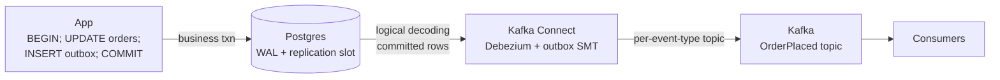

# Transactional outbox and CDC

## 1. TL;DR

You need to mutate a row and publish an event about that mutation, atomically. Your DB does transactions; your message broker isn't enrolled in them, so the obvious code — write the row, then publish — has two failure modes that both corrupt the world. The **transactional outbox** removes the second write by recording the event *inside the same DB transaction* as the business change, then ships it out-of-band. **Change data capture (CDC)** takes that further: the DB's own write-ahead log becomes the event source, and a connector like Debezium turns committed rows into broker messages with no extra app code. You trade exactly-once delivery for at-least-once with idempotent consumers, and accept some operational weight in exchange for never losing or fabricating events again.

## 2. How it works

Start with the failure you are designing around — the **dual-write problem**. The naive code path looks like this:

```
BEGIN;
  UPDATE orders SET status='PLACED' WHERE id=123;
COMMIT;
kafka.send("OrderPlaced", {id: 123});
```

Two things can go wrong, and one of them eventually will:

- **Commit then publish, publish fails.** The DB says yes; the broker times out or the process crashes in the window between `COMMIT` returning and the producer receiving an ack. The order is placed, no one downstream knows. Inventory never decrements; the email never sends. Retrying on process restart requires you to remember what to retry — which is the outbox, just badly implemented in memory.
- **Publish then commit, commit fails.** You moved the publish first; the broker accepted the event, then the txn rolled back (deadlock, constraint violation, connection drop before `COMMIT`). The broker now holds an event for an order that does not exist. Downstream services act on a phantom; there is no "unsend" on Kafka.

No ordering of the two writes is safe — the broker isn't in the DB transaction, and 2PC between Kafka and Postgres is not a real product. You need a different shape.

### Outbox table

Add an `outbox_events` table in the same database (and same logical shard) as the business data:

```
CREATE TABLE outbox_events (
  id           BIGSERIAL PRIMARY KEY,
  aggregate_id TEXT      NOT NULL,
  event_type   TEXT      NOT NULL,
  payload      JSONB     NOT NULL,
  created_at   TIMESTAMPTZ NOT NULL DEFAULT now(),
  published_at TIMESTAMPTZ
);
CREATE INDEX outbox_unpublished
  ON outbox_events (id) WHERE published_at IS NULL;
```

Now the business path becomes one transaction:

```
BEGIN;
  UPDATE orders SET status='PLACED' WHERE id=123;
  INSERT INTO outbox_events (aggregate_id, event_type, payload)
    VALUES ('order:123', 'OrderPlaced', '{"id":123,...}');
COMMIT;
```

Either both rows land or neither does. The dual-write problem is gone — at the cost of having dropped the publish, for now. Something else has to do it.

### Polling relay

The simplest "something else" is a separate process reading unpublished rows and shipping them to the broker:

```
loop forever:
  rows = SELECT * FROM outbox_events
           WHERE published_at IS NULL
           ORDER BY id LIMIT 500;
  for row in rows:
      broker.send(row.event_type, row.payload, key=row.aggregate_id)
      UPDATE outbox_events SET published_at=now() WHERE id=row.id;
```

Semantics are **at-least-once**: if the relay crashes between `broker.send` and the UPDATE, the next iteration re-publishes. Consumers must dedup. The partial index above keeps the poll query cheap as the table grows.

### CDC

The relay still couples the publish path to your app. **Change data capture** removes that by tailing the database's own write-ahead log. Postgres exposes logical replication slots decoded by `pgoutput` (built-in since PG 10, the default plugin Debezium uses today; older deployments may still run `wal2json`). MySQL exposes the binlog, which **must be configured `binlog_format=ROW`** — statement-based or mixed binlogs do not carry the post-image rows CDC needs. MongoDB exposes the oplog. Debezium (inside Kafka Connect, the canonical choice) subscribes to that log, decodes each committed change, and emits a Kafka record per row. Because the log is single-writer-ordered per shard, CDC preserves commit order; because it reads only committed transactions, it never publishes phantoms from a rolled-back txn.

The full topology:



Confluent's **outbox event router** SMT (single-message transform) reshapes raw `outbox_events` row events into per-event-type topics keyed by aggregate ID, so consumers subscribe to `OrderPlaced` rather than to your `outbox_events` table. Without it, every consumer is coupled to your outbox schema.

### Ordering

Per-aggregate order is what you usually want — `OrderPlaced` before `OrderShipped` for the same order. Set the [Kafka partition key](pubsub-semantics.md) to the aggregate ID (`order:123`) and per-partition FIFO carries that ordering end-to-end. Across aggregates there is no global order, and that is the right trade for throughput.

## 3. When to use

- Anywhere you mutate state and need to reliably notify another service: order placement, signup, inventory updates, audit trails.
- Replacing a "write then publish (and pray)" code path you've seen drop messages even once.
- Building event-driven systems on top of an existing transactional database, without rewriting onto an event store.
- Feeding a search index, cache, data warehouse, or downstream microservice from authoritative DB state.

Anti-signals:

- Pure read paths. Nothing to publish.
- Synchronous request/response where the caller needs the downstream effect before the response returns. Outbox is asynchronous; use a direct call.
- Workflows where eventual delivery is unacceptable and you need an explicit success/compensate handshake. Use a [saga](saga.md) (which often uses outbox underneath but adds orchestration on top).

## 4. Trade-offs and failure modes

- **At-least-once, not exactly-once.** Relay and CDC both re-deliver after a crash that landed the broker write but missed the ack. Consumers must be [idempotent](idempotency.md) — same discipline as any retry-prone path.
- **Outbox table grows unboundedly** if the relay or CDC connector falls behind, or if you forget to prune. A background job that deletes published rows older than N hours is non-optional; without it every business write touches a multi-million-row table.
- **Hot outbox.** Every business transaction also writes the outbox row. The relay's poll query must hit the partial index on `published_at IS NULL`, not scan the whole table.
- **CDC operational cost is real.** Debezium drags in Kafka Connect, often a schema registry, and replication-slot management. Engineers need to know what a slot is and how to monitor lag.
- **Replication-slot leak (Postgres).** A logical slot whose consumer stops advancing pins WAL forever — Postgres will not recycle beyond the oldest slot's `restart_lsn`. Disk fills, the database goes read-only, on-call learns about slots the hard way. Alert on `pg_replication_slots.confirmed_flush_lsn` lag, and on PG 13+ set **`max_slot_wal_keep_size`** as the safety knob: the slot is invalidated (and the disk saved) once retained WAL exceeds that bound, at the cost of forcing a Debezium re-snapshot.
- **WAL retention must outlive CDC downtime.** Conversely, if `max_slot_wal_keep_size` (or your archive retention) is tighter than your worst-case Debezium outage, the slot's required WAL is gone and the connector cannot resume without a snapshot. Size it against your incident response SLA, not your average uptime.
- **Schema coupling.** Publish raw row-change events and every consumer pins to your table schema; renaming a column becomes a cross-team migration. Publish *semantic* events (`OrderPlaced`, payload is your contract), not `INSERT INTO orders`. The outbox row is your event-shape boundary.
- **Single-DB scope.** Outbox gives you atomicity inside one database. Two databases mutating atomically is still the dual-write problem at a larger scale — that is what sagas are for.
- **Ordering is per-aggregate, not global.** Consumers expecting a single global order across all aggregates will be wrong. Document the partitioning contract.

## 5. Real-world and interviewer probes

In the wild, **Debezium** is the dominant open-source CDC connector for Postgres, MySQL, MongoDB, SQL Server, and Oracle, deployed via **Kafka Connect**; Confluent ships an **outbox event router** SMT for this pattern. The combination is standard at Netflix, Uber, Airbnb, and Shopify. Cloud-native takes include AWS DMS for CDC into Kinesis or MSK, and managed Debezium on Confluent Cloud.

Probes you should expect:

- *"Why not just publish to Kafka inside the DB transaction?"* — Kafka isn't enrolled in the DB transaction. Publish before commit and the txn might roll back, leaving a phantom event. Publish after commit and the process can die in between, losing the event. The outbox collapses the publish into a single DB write the txn already covers.
- *"Why CDC over a polling relay?"* — Lower latency (WAL streams, no poll cycle), no app code change to add new events, preserves DB-level commit ordering for free, and survives app crashes because the publish path doesn't live in the app. Cost is the operational footprint of Debezium and replication slots.
- *"What about ordering guarantees?"* — Per aggregate, yes: WAL is single-writer-ordered per shard, CDC preserves it, and partition key = aggregate ID maintains it through Kafka. Across aggregates there is no global ordering; that is intentional, because global order would serialize the pipeline.
- *"How is this different from a saga?"* — Outbox is *delivery* atomicity: the event leaves your service iff the local txn committed. A saga is *business-process* atomicity: a multi-step workflow across services either completes or compensates. They compose — a saga step typically uses outbox to publish its "step done" event.
- *"What about exactly-once?"* — You don't get it from the pipeline; you get it from the consumer. Outbox + CDC is at-least-once delivery; the consumer dedups on event ID (or on natural idempotency) for exactly-once *effects*.
- *"What goes wrong in production?"* — Replication-slot leaks pinning WAL until the disk fills, an unpruned outbox that becomes the largest table in the schema, schema changes that break consumers because someone published raw row events instead of semantic ones, and Debezium upgrades requiring a snapshot because a slot expired.
