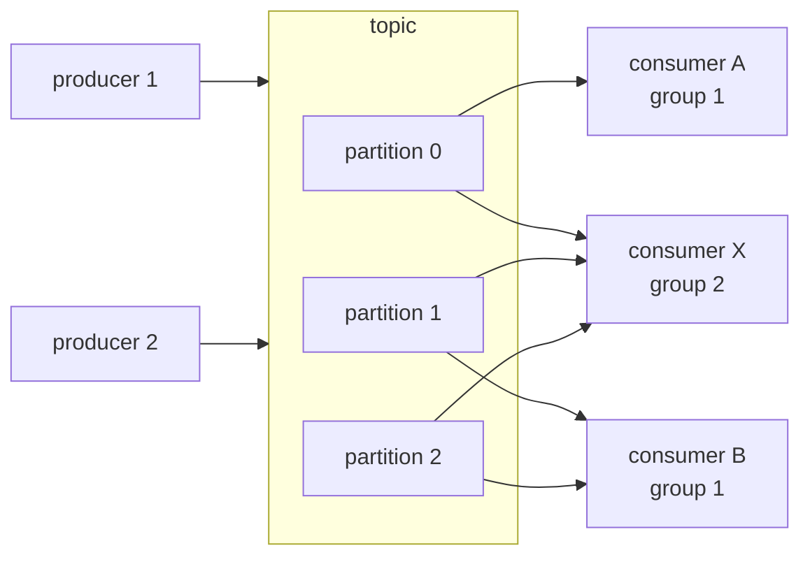

# Pub/sub semantics

## 1. TL;DR

Pub/sub is the easy part: producers publish to a topic, consumers subscribe, the broker decouples them. The hard part — the part every team learns by losing or duplicating production messages — is the operational semantics on top: delivery guarantees, ordering boundaries, replay, rebalances, poison messages. The single most useful framing to carry into an interview is that **"exactly-once delivery" is a marketing term**. Across an unreliable network, the achievable property is at-least-once delivery plus [idempotent consumers](idempotency.md), which together produce exactly-once *effects*. Every other failure mode in this section is a corollary of that fact.

## 2. How it works

A pub/sub system has three nouns — producers, the broker, and consumers — and a handful of dials that decide what guarantees you actually get.



The topic is usually a **partitioned log**. A partition is an append-only ordered file; a topic is N of them. Throughput scales with partition count; ordering is scoped to a single partition. Each partition is assigned to exactly one consumer per group at a time — that is what gives group 1 horizontal parallelism while group 2, with a single consumer, gets the full stream.

### Delivery guarantees

The whole spectrum is decided by **one line of code: when the consumer commits its offset relative to processing**. Same broker, same consumer, same topic — the difference between losing messages and duplicating them is the order of two function calls.

**At-most-once. Commit, then process.**

```
for msg in poll():
    commit_offset(msg)        # broker now believes msg is done
    apply_side_effect(msg)    # crash here → msg is lost forever
```

The broker has been told the message is processed. If `apply_side_effect` crashes, segfaults, or the host loses power before it returns, the next consumer to take this partition resumes from the *next* offset. The message is gone. Acceptable only for telemetry where a dropped sample is noise.

**At-least-once. Process, then commit.**

```
for msg in poll():
    apply_side_effect(msg)    # crash here → next consumer reprocesses
    commit_offset(msg)
```

Crash between the two lines and the broker still has the old offset; on restart, the partition is reassigned and the new owner re-polls from there, redelivering `msg`. Nothing lost, but `apply_side_effect` runs twice. **Duplicates here are not rare — they are routine**: any consumer crash, network blip between consumer and broker, or rebalance mid-batch produces them. Idempotent consumers are not a nice-to-have, they are the contract.

**Exactly-once delivery. Not a thing.** The impossibility is one round trip:

```
producer → message → consumer
producer ← ack      ← consumer    # this ack can be lost on the wire
```

Producer sends a message. Consumer receives, processes, sends ack. The ack is dropped by the network. Producer's retry timer fires; producer cannot tell "ack lost" from "consumer never got it," so producer resends. Consumer gets the message twice. To avoid this, the producer would need either (a) infinite memory of every message ever acknowledged by every consumer that ever existed, or (b) an atomic "process-and-ack" step that survives partial network failure. Neither exists. Two Generals.

What *is* achievable is exactly-once **effects**: at-least-once delivery plus a consumer that recognises duplicates and absorbs them. The recipe:

```
# Producer: stamp every message with a stable ID at the source.
event_id = uuid7()                       # generated once, reused on every retry
publish(topic, key=order_id, headers={"event_id": event_id}, body=...)

# Consumer: at-least-once delivery, idempotent apply.
for msg in poll():
    with db.transaction():               # one atomic unit
        inserted = db.execute(
            "INSERT INTO processed_events(event_id) VALUES (?) "
            "ON CONFLICT DO NOTHING",
            msg.headers["event_id"],
        )
        if inserted.rowcount == 0:
            continue                     # duplicate; effect already applied
        apply_side_effect(msg)           # write to the same DB
    commit_offset(msg)                   # only after the transaction lands
```

Two non-negotiables: **the dedup key is generated once at the producer** (regenerating it on retry defeats the whole mechanism), and **the dedup-table write happens in the same transaction as the side effect**. A dedup row written before the effect doesn't help if the effect crashes; a dedup row written after doesn't help if the consumer crashes between them. They land together or not at all.

If the side effect is in another system (HTTP API, second database), the dedup table in DB-A only guarantees DB-A reflects the event once — it says nothing about the HTTP POST. You need a transactional outbox or a two-phase coordinator; see [the outbox pattern](outbox-cdc.md).

**Exactly-once delivery is a myth; exactly-once effects via consumer-side idempotency is engineering reality.** Every vendor "exactly-once" claim is the latter, scoped to a boundary. Kafka EOS = transactional producer + idempotent producer + read-committed consumer + atomic offset commit, **all within one Kafka cluster** — read from topic A, write to topic B, commit the offset, atomically. The moment the consumer writes to Postgres, calls Stripe, or publishes to a different broker, you are back to at-least-once and the recipe above is what you need. SQS FIFO's "exactly-once" is a five-minute dedup window on the producer side; it cannot help you if your consumer crashes after writing to a downstream system.

### Ordering

**Ordering is per-partition only.** Concretely: a topic with 3 partitions, partition key = `user_id`. Every event for `user_id=42` hashes to the same partition (say partition 1) — always, forever, deterministically. Partition 1 is owned by one consumer in the group at any given moment, and that consumer reads it strictly in offset order. So all 42's events are processed in the order they were published.

Events for `user_id=99` may live on partition 0 and be processed by a different consumer at a different rate. There is no defined ordering between user 42's events and user 99's events. **Global ordering across a topic does not exist** — that is the price of partitioning.

The partition key is the design decision. Pick the aggregate ID whose internal causal order matters: `order_id` for an orders topic, `user_id` for a user-activity topic, `account_id` for ledger entries. Get this wrong (e.g. partition by `region` for a per-user system) and either you lose per-aggregate ordering, or one partition becomes a hotspot.

Global ordering across a topic requires a single partition, which collapses throughput to one consumer's processing rate. You have built a queue, not a partitioned log. Almost always the right answer is that the business invariant is per-aggregate, not global.

### Consumer groups and rebalances

A **consumer group** is a set of processes cooperatively consuming a topic. The broker assigns each partition to exactly one consumer in the group at a time — that constraint is what preserves per-partition ordering, since two consumers reading the same partition concurrently would interleave commits.

A different group on the same topic gets the full stream independently. That is the fan-out primitive: notifications, projections, audit, analytics each as their own group at their own pace.

**Rebalance, walked through.** 3 partitions, 3 consumers — A owns 0, B owns 1, C owns 2. Add a 4th consumer D and the group rebalances:

1. Broker tells the group: stop consuming.
2. Every consumer pauses, finishes its in-flight batch, commits its offset.
3. Broker reassigns — say A keeps 0, B keeps 1, C gives up 2 to D, C is now idle (4 consumers, 3 partitions, the extra one sits with nothing).
4. Each consumer resumes from the last committed offset on whatever partitions it now owns.

During steps 1–3 **the entire group is stopped-the-world**. Every partition pauses, not just the moving ones. With three partitions and a 5-second rebalance, you just added 5 seconds of lag to every consumer. **Frequent rebalances tank throughput**, and the pathological version is the `max.poll.interval.ms` cascade described in §4.

A 4th consumer beyond the partition count is wasted capacity. **Scaling out a consumer group only helps up to the partition count**; past that, additional consumers idle. If you need more parallelism, you need more partitions — and repartitioning a live topic is itself an operation, since old keys may rehash to new partitions and break per-key ordering during the cutover.

### Offset management

The consumer tracks its position in each partition as an **offset**. Commit-after-process gives at-least-once; commit-before-process gives at-most-once; the placement of `commit_offset()` in §2 is the entire story.

**Auto-commit-on-a-timer is a footgun.** Kafka's default `enable.auto.commit=true` ticks every `auto.commit.interval.ms` (5 seconds by default) and commits whatever the consumer has *polled*, not what it has *processed*. A message you fetched at second 4, started processing at second 4.5, and crashed on at second 6 — its offset was already committed at second 5. Your nominally at-least-once consumer just lost a message. Disable auto-commit. Commit explicitly after the side effect lands.

### Dead-letter queues

A **poison message** — malformed payload, schema mismatch, bug in the consumer that always throws — will fail forever. Without a circuit breaker, the consumer retries it, blocks the partition behind it, and the lag graph climbs into orbit. The standard pattern: bounded retries with backoff, then route to a **dead-letter queue** for inspection. Alert on DLQ depth; an empty DLQ is healthy, a growing DLQ is an outage you will soon notice anyway.

### Replay

Because the partitioned log retains history (Kafka by retention policy; SQS does not — it deletes on ack), you can rewind a consumer's offset and reprocess. Replay is how you backfill a new projection, rebuild a corrupted read model, or rerun after fixing a consumer bug. The catch: consumers must be safe to replay, which is the same idempotency requirement, restated. If replay produces duplicate downstream side effects, your consumer wasn't idempotent in the first place — you just didn't notice because reprocessing was rare.

## 3. When to use

- Decoupled service-to-service notification, where the publisher does not know or care who consumes. Adding a consumer is a deployment, not a producer change.
- Fan-out: one event drives many independent consumers — emails, projections, search indexing, audit, analytics — each in its own group at its own pace.
- Burst absorption. The broker buffers traffic the consumers cannot keep up with, and the lag drains when the spike ends. The producer is no longer coupled to the slowest consumer.
- Event-driven architectures. Combined with [the outbox pattern or CDC](outbox-cdc.md), pub/sub becomes a reliable spine for state propagation across services.

Anti-signals:

- Synchronous request/response where the caller needs an answer in the same hop. Pub/sub is asynchronous; do an RPC.
- Very small systems where a direct call between two services is simpler than standing up Kafka. Pub/sub has operational weight; introducing it for one consumer is overkill.
- Workflows that need explicit success/compensate handshakes — that is a saga, which often uses pub/sub underneath but adds orchestration on top.

## 4. Trade-offs and failure modes

- **Duplicates are routine, not rare.** At-least-once means redelivery on every consumer crash, network blip, or commit-before-broker-ack race. Idempotency is the contract, not an optimisation.
- **Ordering is per-partition only.** Cross-partition ordering does not exist, by design. If your invariant requires "event A before event B," they must share a partition key — usually because they share an aggregate.
- **The `max.poll.interval.ms` cascade.** A slow message (DB lock, GC pause, downstream timeout) keeps a consumer past its poll deadline. Broker evicts it; group rebalances; that consumer's partitions move to a peer who is *also* near its deadline because it was already behind processing its own. Symptom: rolling rebalances, lag climbing on every partition, log spam reading "this consumer is no longer a member of the group." **Fix the cause (per-message processing time) before tuning timeouts** — raising `max.poll.interval.ms` past your real SLO just delays the eviction. Cooperative rebalance protocols (Kafka's `CooperativeStickyAssignor`) make each rebalance pause only moving partitions, not the whole group, which softens the blast radius but does not fix slow processing.
- **Slow consumer = backlog growth.** Consumer lag (broker offset minus committed offset) is the canary — the [backpressure](backpressure-load-shedding.md) signal of a partitioned log. Monotonic growth means you are losing ground. Remedies: parallelize within a partition (safe only if processing is per-message, not per-key sequence), repartition, or scale out the group up to the partition count.
- **Poison messages.** One unprocessable message at the head of a partition blocks every message behind it. Bounded retries with exponential backoff, then DLQ. Without DLQ, the consumer loops forever and the partition stalls.
- [**Schema evolution**](schema-evolution.md)**.** Producers and consumers deploy independently, so backward-compatibility on the wire is non-negotiable. Use a schema registry plus Protobuf or Avro; treat field removal as a breaking change; never reuse a field number.
- **The "exactly-once" myth, restated for the people in the back.** Every vendor "exactly-once" claim is scoped to its own boundary, and that boundary almost never reaches your real side effects. **Kafka EOS works only within Kafka** (topic A → topic B + offset commit, atomically); cross into Postgres or Stripe and you are back to at-least-once. **SQS FIFO dedup is a producer-side 5-minute window** keyed on `MessageDeduplicationId`; it does nothing for consumer-side duplicates from rebalances or visibility-timeout expiry. **Google Pub/Sub "exactly-once delivery" is a per-subscription dedup of redeliveries within an ack-deadline window**, again upstream of your side effect. The answer is always the consumer-side dedup recipe in §2, not a configuration flag.

## 5. Real-world and interviewer probes

In the wild: **Apache Kafka** (partitioned log, consumer groups, offset-based replay, retention measured in days or topics-as-tables); **Amazon SQS** (queues with at-least-once and built-in dedup IDs on FIFO queues; standard queues are best-effort ordering); **Google Pub/Sub** (push or pull, ack-deadline-driven redelivery, per-key ordering); **RabbitMQ** (queues with manual ack, traditional message-broker model rather than partitioned log); **NATS JetStream** (lightweight, log-backed); **Apache Pulsar** (segmented storage, tiered to object storage).

Probes you should expect:

- *"Why is exactly-once delivery a myth?"* — Across an unreliable network, a consumer cannot atomically process a message and acknowledge it; either the ack or the processing can be lost on the wire. What is achievable is at-least-once delivery plus idempotent processing — exactly-once *effects*. Vendors who advertise exactly-once mean within their own broker boundary, not end-to-end across your side effects.
- *"How do you guarantee ordering?"* — Per-partition only. Choose the partition key as the aggregate ID so all events for one entity land on one partition; one consumer per partition per group preserves the order through to processing. There is no global ordering, by design.
- *"How do you handle a poison message?"* — Bounded retries with backoff, then route to a dead-letter queue. Alert on DLQ depth. Never let a single bad message block its partition forever.
- *"What happens during a consumer rebalance?"* — The group pauses, partitions are reassigned, processing resumes. Frequent rebalances — from churn, slow processing exceeding the poll interval, or autoscaling — are a scaling killer; tune intervals and use cooperative rebalance protocols.
- *"Walk me through achieving exactly-once effects."* — Producer attaches a stable dedup key (event ID, request ID). Consumer is at-least-once. Before applying the side effect, consumer checks the dedup key against a store (DB unique index, Redis SETNX, idempotency table); if present, drop. If absent, apply the effect and record the key in the same transaction as the effect. Net result: duplicates from the broker are absorbed silently.
- *"Why not just use a single partition for global ordering?"* — Throughput collapses to one consumer's rate, and you have built a queue, not a partitioned log. If the business genuinely needs global order, the right answer is usually that it does not — re-examine whether the ordering invariant is per-aggregate.
