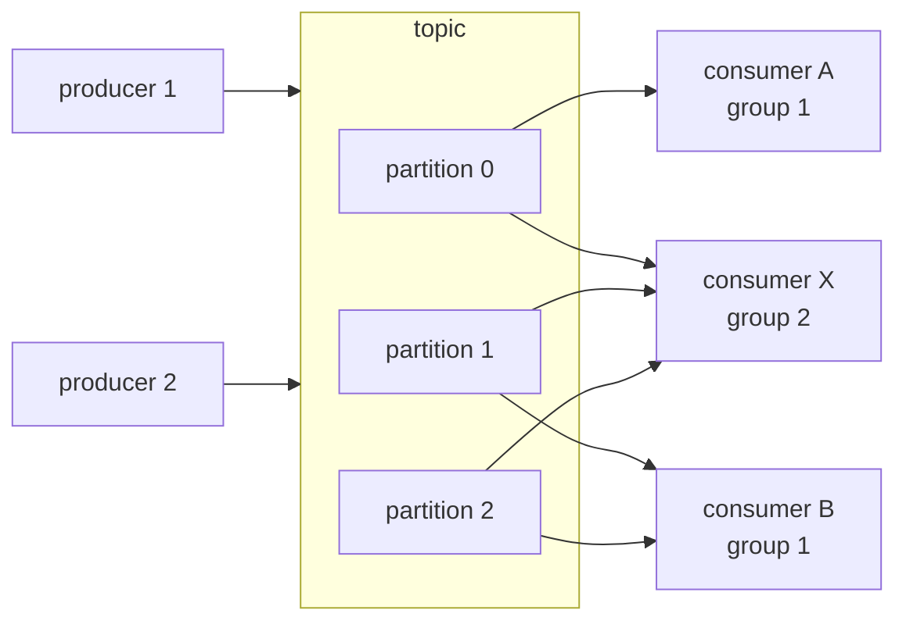

# Pub/sub semantics

## 1. TL;DR

Pub/sub is the easy part: producers publish to a topic, consumers subscribe, the broker decouples them. The hard part — the part every team learns by losing or duplicating production messages — is the operational semantics on top: delivery guarantees, ordering boundaries, replay, rebalances, poison messages. The single most useful framing to carry into an interview is that **"exactly-once delivery" is a marketing term**. Across an unreliable network, the achievable property is at-least-once delivery plus [idempotent consumers](idempotency.md), which together produce exactly-once *effects*. Every other failure mode in this section is a corollary of that fact.

## 2. How it works

A pub/sub system has three nouns — producers, the broker, and consumers — and a handful of dials that decide what guarantees you actually get.



The topic is usually a **partitioned log**. A partition is an append-only ordered file; a topic is N of them. Throughput scales with partition count; ordering is scoped to a single partition. Each partition is assigned to exactly one consumer per group at a time — that is what gives group 1 horizontal parallelism while group 2, with a single consumer, gets the full stream.

### Delivery guarantees

Three points on the spectrum, set by *when* the consumer commits its offset relative to processing:

- **At-most-once.** Commit (or ack) on receive, then process. If the consumer crashes mid-processing, the message is gone — already acked. Lossy. Acceptable only for telemetry where a missed sample is fine.
- **At-least-once.** Process first, commit on success. If the consumer crashes after processing but before committing, the broker redelivers on restart. Standard default. Requires consumers be idempotent because duplicates are not "rare" — they are routine.
- **Exactly-once.** Not achievable as a delivery property across an unreliable network. The Two Generals Problem: the consumer cannot both process and ack in a single atomic step the network can confirm. What is achievable is exactly-once *effects*, by combining at-least-once delivery with idempotent processing — typically a dedup key carried on the message and checked against a store before applying the side effect.

The recipe for exactly-once effects, end-to-end:

```
# Producer: stamp every message with a stable ID at the source.
event_id = uuid7()                       # stable, derived once, never regenerated on retry
publish(topic, key=order_id, headers={"event_id": event_id}, body=...)

# Consumer: at-least-once delivery, idempotent apply.
for msg in poll():
    with db.transaction():               # one atomic unit
        inserted = db.execute(
            "INSERT INTO processed_events(event_id) VALUES (?) "
            "ON CONFLICT DO NOTHING",
            msg.headers["event_id"],
        )
        if inserted.rowcount == 0:
            continue                     # duplicate; effect already applied
        apply_side_effect(msg)           # write to the same DB
    commit_offset(msg)                   # only after the transaction lands
```

The two non-negotiables: the dedup key is generated once at the producer (not per retry), and the dedup-table write happens in the *same* transaction as the side effect. If the side effect is in another system (HTTP API, second database), you need a transactional outbox or a two-phase coordinator — see [the outbox pattern](outbox-cdc.md). A dedup table in DB-A cannot guarantee an HTTP POST to service B happened exactly once; it can only guarantee that DB-A reflects the event exactly once.

When a vendor advertises "exactly-once," ask precisely which step. Kafka EOS, for example, is transactional producer + read-committed consumer + transactional offset commit, all within a single Kafka cluster — you publish to topic A, read from topic A, write to topic B, commit the offset, all atomically. The moment the consumer's side effect leaves the broker (writing to Postgres, calling Stripe, publishing to a different cluster), Kafka EOS no longer applies and you are back to at-least-once + idempotent consumer. SQS FIFO's built-in dedup is a five-minute message-deduplication window on the *producer* side, not effect-level idempotency on the consumer side.

### Ordering

Ordering is per-partition. The broker guarantees messages within one partition are delivered to a consumer in the order they were appended; across partitions there is no order. The **partition key** is what binds related messages into the same ordering domain — typically the aggregate ID (`order:123`, `user:42`). Same key, same partition, same order. Different keys, no relationship.

Global ordering across a topic requires a single partition, which caps throughput at one consumer's processing rate. Almost always the wrong trade. Pick the right partition key instead.

### Consumer groups

A **consumer group** is a set of processes cooperatively consuming a topic. The broker assigns each partition to exactly one consumer in the group at a time. Add a consumer, the broker rebalances and reassigns. The constraint — one partition per consumer per group — is what preserves per-partition ordering: two consumers reading the same partition concurrently would interleave their commits and break order.

Two different groups on the same topic each get the full stream independently. That is the fan-out primitive: notifications, projections, audit, analytics each subscribe as their own group and read at their own pace.

### Offset management

The consumer tracks its position in each partition as an **offset**. Commit-after-process gives at-least-once; commit-before-process gives at-most-once. Auto-commit-on-a-timer is a footgun — it will commit while a message is still in-flight, turning your at-least-once consumer into at-most-once on the next crash. Disable auto-commit, commit explicitly after the side effect lands.

### Dead-letter queues

A **poison message** — malformed payload, schema mismatch, bug in the consumer that always throws — will fail forever. Without a circuit breaker, the consumer retries it, blocks the partition behind it, and the lag graph climbs into orbit. The standard pattern: bounded retries with backoff, then route to a **dead-letter queue** for inspection. Alert on DLQ depth; an empty DLQ is healthy, a growing DLQ is an outage you will soon notice anyway.

### Replay

Because the partitioned log retains history (Kafka by retention policy; SQS does not — it deletes on ack), you can rewind a consumer's offset and reprocess. Replay is how you backfill a new projection, rebuild a corrupted read model, or rerun after fixing a consumer bug. The catch: consumers must be safe to replay, which is the same idempotency requirement, restated. If replay produces duplicate downstream side effects, your consumer wasn't idempotent in the first place — you just didn't notice because reprocessing was rare.

## 3. When to use

- Decoupled service-to-service notification, where the publisher does not know or care who consumes. Adding a consumer is a deployment, not a producer change.
- Fan-out: one event drives many independent consumers — emails, projections, search indexing, audit, analytics — each in its own group at its own pace.
- Burst absorption. The broker buffers traffic the consumers cannot keep up with, and the lag drains when the spike ends. The producer is no longer coupled to the slowest consumer.
- Event-driven architectures. Combined with [the outbox pattern or CDC](outbox-cdc.md), pub/sub becomes a reliable spine for state propagation across services.

Anti-signals:

- Synchronous request/response where the caller needs an answer in the same hop. Pub/sub is asynchronous; do an RPC.
- Very small systems where a direct call between two services is simpler than standing up Kafka. Pub/sub has operational weight; introducing it for one consumer is overkill.
- Workflows that need explicit success/compensate handshakes — that is a saga, which often uses pub/sub underneath but adds orchestration on top.

## 4. Trade-offs and failure modes

- **Duplicates are routine, not rare.** At-least-once means redelivery on every crash, network blip, or commit-before-broker-ack race. Consumer idempotency is not a nice-to-have; it is the contract.
- **Ordering is per-partition only.** Cross-partition ordering does not exist, by design. If your business invariant requires "event A before event B," they must share a partition key — usually because they share an aggregate.
- **Rebalance pauses, and the max-poll cascade.** When a consumer joins, leaves, or fails its heartbeat, the group rebalances: all consumers pause, partitions are reassigned, processing resumes. The pathological mode is the `max.poll.interval.ms` cascade: a slow message (DB lock, GC pause, slow downstream) keeps the consumer past the poll deadline, the broker evicts it, the group rebalances, that consumer's partitions move to a peer who is *also* near its deadline because it was already behind, and so on. Symptom: rolling rebalances, lag climbing, consumers logging "this consumer is no longer a member of the group." Fix the *cause* (per-message processing time) before tuning timeouts; raising `max.poll.interval.ms` past your real SLO just delays the eviction. Use cooperative rebalance protocols (Kafka's `CooperativeStickyAssignor`) so each rebalance only pauses moving partitions, not the whole group.
- **Slow consumer = backlog growth.** Consumer lag (broker offset minus committed offset) is the canary — the [backpressure](backpressure-load-shedding.md) signal of a partitioned log. When it grows monotonically, you are losing ground. Remedies: parallelize within a partition (only safe if processing is per-message, not per-key sequence), repartition the topic, or scale out the consumer group up to the partition count — not beyond, because extra consumers sit idle.
- **Poison messages.** One unprocessable message at the head of a partition blocks every message behind it. Bounded retries with exponential backoff, then DLQ. Without DLQ, the consumer loops forever and the partition stalls.
- [**Schema evolution**](schema-evolution.md)**.** Producers and consumers deploy independently, so backward-compatibility on the wire is non-negotiable. Use a schema registry plus Protobuf or Avro; treat field removal as a breaking change; never reuse a field number.
- **The "exactly-once" myth.** Repeated deliberately because every team rediscovers it. Vendor "exactly-once" is always scoped: Kafka EOS is transactional within one Kafka cluster (producer fencing + read-committed isolation + atomic offset commit); SQS FIFO dedup is a producer-side five-minute window. The moment your consumer's effect leaves that boundary — to Postgres, to Stripe, to a different broker — you are back to at-least-once, and the answer is the dedup-key recipe in §2, not a configuration flag.

## 5. Real-world and interviewer probes

In the wild: **Apache Kafka** (partitioned log, consumer groups, offset-based replay, retention measured in days or topics-as-tables); **Amazon SQS** (queues with at-least-once and built-in dedup IDs on FIFO queues; standard queues are best-effort ordering); **Google Pub/Sub** (push or pull, ack-deadline-driven redelivery, per-key ordering); **RabbitMQ** (queues with manual ack, traditional message-broker model rather than partitioned log); **NATS JetStream** (lightweight, log-backed); **Apache Pulsar** (segmented storage, tiered to object storage).

Probes you should expect:

- *"Why is exactly-once delivery a myth?"* — Across an unreliable network, a consumer cannot atomically process a message and acknowledge it; either the ack or the processing can be lost on the wire. What is achievable is at-least-once delivery plus idempotent processing — exactly-once *effects*. Vendors who advertise exactly-once mean within their own broker boundary, not end-to-end across your side effects.
- *"How do you guarantee ordering?"* — Per-partition only. Choose the partition key as the aggregate ID so all events for one entity land on one partition; one consumer per partition per group preserves the order through to processing. There is no global ordering, by design.
- *"How do you handle a poison message?"* — Bounded retries with backoff, then route to a dead-letter queue. Alert on DLQ depth. Never let a single bad message block its partition forever.
- *"What happens during a consumer rebalance?"* — The group pauses, partitions are reassigned, processing resumes. Frequent rebalances — from churn, slow processing exceeding the poll interval, or autoscaling — are a scaling killer; tune intervals and use cooperative rebalance protocols.
- *"Walk me through achieving exactly-once effects."* — Producer attaches a stable dedup key (event ID, request ID). Consumer is at-least-once. Before applying the side effect, consumer checks the dedup key against a store (DB unique index, Redis SETNX, idempotency table); if present, drop. If absent, apply the effect and record the key in the same transaction as the effect. Net result: duplicates from the broker are absorbed silently.
- *"Why not just use a single partition for global ordering?"* — Throughput collapses to one consumer's rate, and you have built a queue, not a partitioned log. If the business genuinely needs global order, the right answer is usually that it does not — re-examine whether the ordering invariant is per-aggregate.
