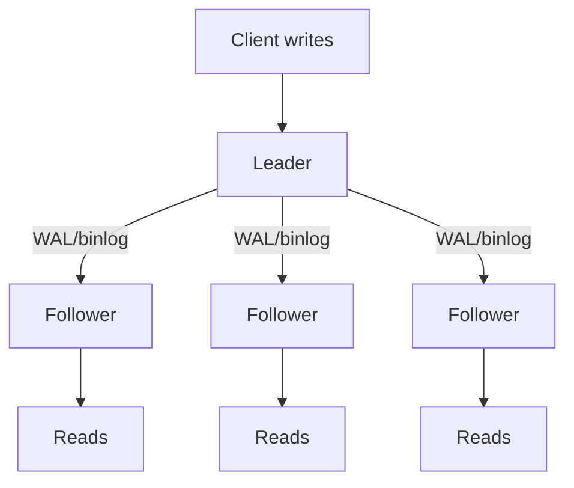
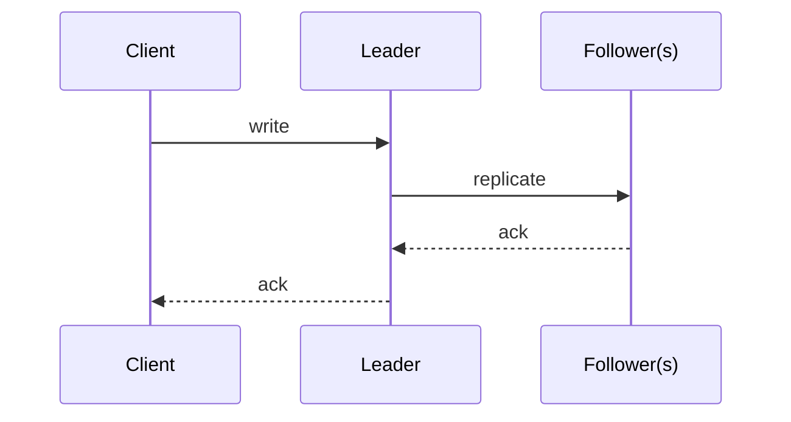
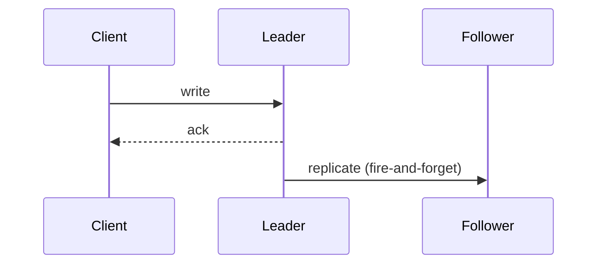
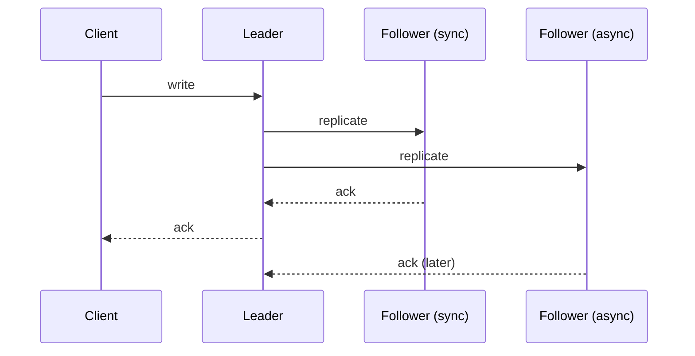

# Replication

## 1. TL;DR

**Replication** keeps copies of the same data on multiple nodes so the system survives node loss, scales reads, and serves geographically distributed clients with local latency. The whole topic is a **3 by 3 matrix**: a **model** (single-leader, multi-leader, leaderless) crossed with a **timing** (synchronous, asynchronous, semi-synchronous). Every cell trades consistency, write latency, and availability against each other; **the wrong combination drops data on failover, stalls every writer on a slow replica, or quietly serves stale reads**. There is no "best" setup, only a set of failure modes you have explicitly chosen to live with.

## 2. How it works

### Single-leader (primary-replica)

One node is the **leader**; it accepts all writes, appends them to a change log, and streams the log to **followers** that apply the same changes in the same order. Reads can hit the leader or any follower. Default for Postgres, MySQL, MongoDB replica sets — **the consistency model is simple because there is exactly one serial point for writes**.

Walk a write through it: client opens a connection to the leader, sends `UPDATE accounts SET balance=900 WHERE id=42`. Leader writes to its WAL (Postgres) or binlog (MySQL), assigns it a log position (LSN/GTID), commits locally, and streams the same log record to each follower over a long-lived TCP connection. Each follower appends the record to its own WAL, then replays it against its data files. Reads on a follower see the change once replay catches up to that LSN.

**The leader is a write bottleneck and a SPOF until failover completes.**

### Multi-leader

Multiple nodes accept writes — typically one leader per region — and replicate to each other. You get write availability under regional partition and lower write latency for users near a local leader. **The cost is conflict resolution**: two regions can write the same row simultaneously, and you need a deterministic rule for what wins.

Walk a write: user in `us-east` updates their profile against the `us-east` leader; leader applies it locally, returns 200 to the client, and ships the record to `eu-west` and `ap-south` over a (usually async) inter-region link. Each peer applies it to its own copy. If `eu-west` was independently writing the same row in the same second, both leaders end up with diverging local state until the records cross and the conflict resolver runs.

Resolution options ranked by data-loss risk: **last-write-wins** (a timestamp picks one, the loser is dropped — simple and lossy under any clock skew), **CRDTs** (merges are commutative, associative, idempotent — no loss, but only the data types CRDTs cover: counters, grow-only sets, OR-sets, LWW-registers, and a few list/map variants with their own caveats), and **application-level merge** (custom code per type — no loss, full flexibility, expensive to build and reason about).

### Leaderless (Dynamo-style)

No leader. The client (or a coordinator) writes to **N** replicas and reads from a quorum; success requires **W** acks on write and **R** on read, with `W + R > N` for [quorum overlap](quorum-consistency.md).

Walk a write with `N=3, W=2, R=2`: coordinator hashes the key to pick three replicas, fans the write to all three in parallel, and returns success to the client as soon as any two ack. The third replica may never have seen the write at this point. On read, the coordinator queries any two replicas; if they disagree, it picks the higher-version copy and writes the missing value back to the laggard (**read repair**). Background **anti-entropy** (Merkle-tree sweeps) catches keys that never get read, and **hinted handoff** lets a peer hold writes for a temporarily unreachable node and replay them on recovery. Cassandra and DynamoDB are canonical. **Highly available — any node can take a write — but consistency is weak unless quorums are tuned, and even then not linearizable.**

### Synchronous vs asynchronous vs semi-synchronous

These are independent of model — they describe *when the write returns to the client*.

Synchronous: leader waits for every follower to ack before replying to the client.

Asynchronous: leader replies as soon as it has the write locally; followers catch up on their own.

Semi-synchronous: leader waits for at least one follower ack, the rest catch up async.

Walk it on a financial transfer. Customer moves $1000 from checking to savings; the database commits the debit row. **Sync**: leader fsyncs locally (~1ms), ships the record to a replica in another rack, replica fsyncs (~1ms), acks; total commit ~3-5ms over a LAN, ~30-80ms cross-AZ. Leader crashes a second later — **the replica already has the write, no data loss, RPO = 0**. **Async**: leader fsyncs locally, returns 200 immediately (~1ms), then ships the record. Leader crashes 100ms later before the record left the box — **the $1000 transfer is gone**; the customer sees a successful confirmation, the new leader has no record of it. RPO = "however much was in flight," typically seconds under load. For money movement, **sync (or semi-sync with `min.insync.replicas >= 2`) is the only safe choice**.

Now invert the workload: a social newsfeed write. User posts a comment; if the leader crashes and loses the last 200ms of comments, the user retries and reposts — annoying, not dangerous. Sync would force every comment to wait on cross-AZ fsync, **inflating p99 from ~5ms to ~50ms for no business value**. Async wins.

**Synchronous** waits for replica acks before acknowledging the client. Strong durability — a committed write survives leader loss — but write latency equals the slowest replica, and one slow replica stalls every writer. **Asynchronous** acks the client as soon as the leader has the write; replicas catch up on their own time. Fast writes, but a leader crash loses everything not yet shipped. **Semi-synchronous** waits for at least one replica ack: **durability of "at least two copies" without the liveness trap of full sync** — this is what most production systems actually run.

### Failover and split brain

When the leader fails, the cluster must detect the failure, elect a new leader, and route writes to it. Detection is timeout-based and **inherently ambiguous — "slow" and "dead" look identical from outside**. Promote too eagerly and the old leader returns to find a new one has accepted conflicting writes: **split brain**.

Walk it concretely. Postgres primary in `us-east-1a` loses its network link to the standby in `us-east-1b` — the primary itself is healthy, still accepting writes from app servers in its own AZ. The standby's heartbeat times out after 10s; orchestrator (Patroni, RDS control plane) promotes the standby to primary. Meanwhile, **app servers that still have a TCP connection to the original primary keep writing to it for the ~30s it takes the floating IP to fail over (or DNS TTL to expire, or the connection pool to recycle)**. For that window, two primaries each accept conflicting writes against the same row. When the network heals, both nodes have committed records the other has never seen. There is no automatic merge — somebody's writes get rolled back, and any external side effects (charges sent, emails fired) are now divorced from the database state.

Defenses: [**quorum-based leader election**](leader-election-consensus.md) (a majority must agree, so two leaders cannot both hold a majority — Raft, Paxos), **fencing tokens** (each new leader gets a monotonically increasing epoch; replicas and shared storage reject writes from a stale one), and **STONITH** ("Shoot The Other Node In The Head" — fence the old primary at the network or power level *before* the new one is allowed to take writes; AWS RDS Multi-AZ does this implicitly via the storage layer, hand-rolled clusters need explicit power control or switch ACL changes).

### Replication lag

Async (and semi-sync) followers run behind the leader by some delta. Healthy Postgres streaming replication on a LAN sits at **5-50ms**; cross-region it's the inter-region RTT plus apply time, often **50-200ms**. Under load — slow disk on the replica, autovacuum, a 10GB transaction the leader committed in one shot — **lag spikes from milliseconds to seconds-to-minutes**, and the replica falls behind faster than it can catch up.

User-visible failure mode is **read-after-write inconsistency**. Walk it: user posts a comment against the leader, page reloads and the read goes to a follower (load balancer round-robin), follower has not yet replayed the write, UI renders the page without the comment the user just submitted. They post again. Now there are two copies. Mitigations are routing-based:

- **Read-your-writes window**: for ~30s after a user's last write, route their reads to the leader (sticky session, or a `last_write_at` timestamp in the cookie/JWT).
- **LSN-aware reads**: client carries the log position from the write response (`pg_current_wal_lsn()`); the read query waits on a follower until that follower's `pg_last_wal_replay_lsn()` has passed it, then runs.
- **Monotonic reads**: pin a user's session to a single follower so they never see time go backwards by hopping between replicas at different lag levels.

## 3. When to use

- **Durability.** A node disk dies; another copy survives. The minimum reason to replicate any production datastore.
- **Read scaling.** Add followers, route reads to them, multiply read throughput. Works because most workloads are read-heavy.
- **Geo-distribution.** A replica per region gives users local-latency reads and survives a region outage.
- **High availability.** Failover shrinks the unavailable window from "until human intervention" to seconds, if the failover machinery is right.

Anti-signals:

- **Data that does not need durability or scale.** Cache contents, ephemeral session state, derivable views — replicating them costs complexity and yields nothing the next miss cannot recover.
- **Replication as a substitute for backups.** Replicas faithfully replicate corruption and `DROP TABLE`. You still need point-in-time backups.

## 4. Trade-offs and failure modes

- **Replication lag and stale reads.** Async followers serve stale data — milliseconds in steady state, seconds-to-minutes under load. Read-your-writes requires either pinning the user's reads to the leader for a window, or carrying an LSN with the request and waiting for the follower to catch up.
- **Split brain after failover.** Two nodes both believe they are leader and both accept writes against the same rows. Fence the old leader (epoch token rejected by replicas, STONITH at network or power level) and **require quorum for election so two leaders cannot both hold a majority**. Without these, a "self-healing" partition silently corrupts your data.
- **Sync replication is a liveness trap.** With full sync, write latency equals the slowest replica, and any unhealthy replica blocks every writer. Production systems run **semi-sync, sync to a small subset, or auto-degrade a lagging replica out of the sync set** — Postgres's `synchronous_standby_names = 'ANY 1 (s1, s2, s3)'` and Kafka's `min.insync.replicas` are this pattern.
- **Multi-leader conflicts.** Walk the same scenario through three resolvers: user record updated concurrently in `us-east` (sets `name = "Maria"`) and `eu-west` (sets `name = "María"`). **LWW**: whichever record has the later timestamp wins, the other's update silently disappears; if the eu-west clock is 200ms ahead due to NTP skew, the us-east write is lost even though it was wall-clock later. **CRDTs**: counters and sets merge cleanly (incrementing a like-count from two regions just adds), but a free-text string field has no commutative merge — you fall back to LWW-register semantics anyway. **Application merge**: business code runs `merge(local, remote)` per field — "newer city wins, but never overwrite a verified email; for `name`, prefer the value with diacritics" — correct and bespoke and expensive. **Most teams pick LWW and accept the silent loss because they have not measured how often it fires.**
- **Topology choices.** **Chain** (leader to A to B to C) has low fan-in but a long tail and no path around a dead middle node. **Star** has a single fan-out hub that is a bottleneck and SPOF. **All-to-all** has the most paths but the hardest conflict-detection problem; the typical multi-leader topology.
- **Backfill cost.** A new replica must transfer the entire dataset before joining the streaming log. **Unthrottled crushes the leader** (sequential scan + network saturation while taking live writes); throttled takes hours or days for a multi-TB dataset. Most systems support a base snapshot plus log-tail catch-up; some (Postgres `pg_basebackup`, MySQL clone plugin) parallelize the snapshot.
- **Replication does not help logical errors.** Schema changes, mass deletes, application bugs that corrupt rows, ransomware — **replication multiplies them across every node instantly**. Backups (point-in-time, off-cluster, tested for restore) save you here, not replicas.

## 5. Real-world and interviewer probes

In the wild, **Postgres** does single-leader streaming replication, with `synchronous_commit` controlling the durability point per transaction — `off` (async, may lose committed writes on crash), `local` (fsync to local WAL only), `on` (default; sync to one named standby's WAL), `remote_write` (standby has it in OS buffers), `remote_apply` (standby has applied it and queries see it). The set of synchronous standbys is named in `synchronous_standby_names`. **MySQL** uses binlog replication, single-leader, with semi-sync available via `rpl_semi_sync_master_enabled` (and a timeout that silently degrades to async on stall — read the fine print). **MongoDB** replica sets are single-leader with Raft-like elections; `writeConcern: "majority"` is the durable default. **Cassandra** and **DynamoDB** are leaderless with tunable quorums (`R`, `W`, `N`). **CockroachDB** and **Spanner** replicate per-range with Raft, giving per-range single-leader semantics globally. **Kafka** elects a leader per partition and replicates to in-sync replicas (the ISR set); `acks=all` waits for every member of the **current** ISR — which can shrink to one under failure unless you also set `min.insync.replicas` to reject writes when the ISR is too small.

Probes you should expect:

- *"Sync vs. async vs. semi-sync — when?"* — Financial or no-data-loss workloads → sync, accepting the latency tax. Latency-sensitive workloads with a tolerable RPO → async with a replica-lag SLO. The default is semi-sync: one replica ack, durability of "at least two copies", no full-sync liveness trap.
- *"How do you avoid split brain?"* — Quorum-based leader election (Raft / Paxos), monotonic fencing tokens replicas verify before accepting writes, and STONITH when the old leader's network must be cut before promoting a new one.
- *"Read-your-writes on a read replica?"* — Either route reads to the leader for a session window after a write, or carry a log sequence number with each request and have the replica wait until it has applied past that position.
- *"Multi-leader conflict resolution?"* — LWW: simple, silently lossy. CRDTs: no loss, limited operations. Application merge: correct, custom, expensive. Pick by how much loss you can tolerate; most teams pick LWW because they have not measured it.
- *"Why not sync to all replicas always?"* — Latency equals the slowest replica, and one slow replica stalls every writer. Run semi-sync, sync to a small quorum, or auto-degrade a lagging replica out of the sync set.
- *"Failover detection — too fast vs. too slow?"* — Too fast and you flap on transient blips, promoting leaders that race the old one. Too slow and the unavailable window grows. Standard answer: multi-second timeouts plus quorum confirmation before promotion.
- *"What does replication not protect against?"* — Logical corruption, bad migrations, application bugs, ransomware. Replicas faithfully copy all of those. You still need backups.
