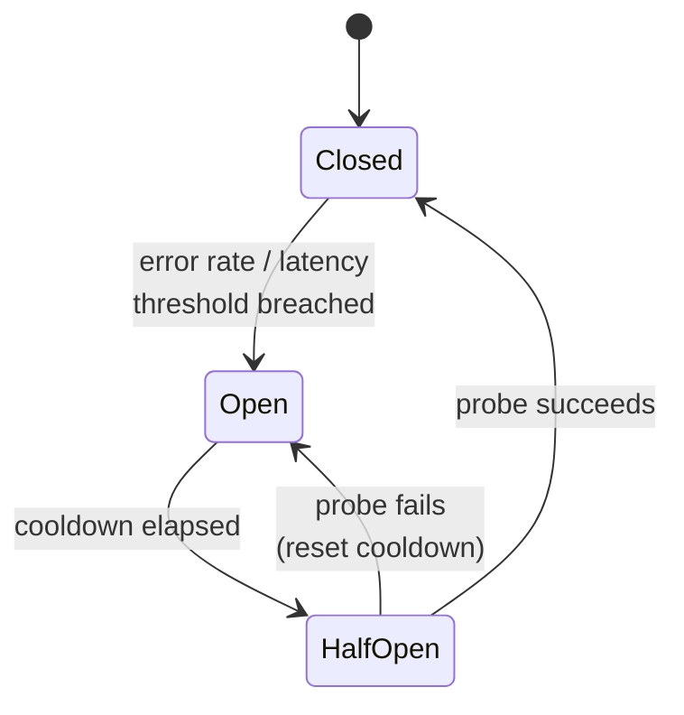

# Resilience four-pack: timeout, retry, circuit breaker, bulkhead

## 1. TL;DR

Four patterns protect every service-to-service call: a **timeout** so you stop waiting, a **retry with jittered backoff** so a transient hiccup doesn't fail the request, a **circuit breaker** so you stop hammering a sick dependency, and a **bulkhead** so one sick dependency cannot drain the resources you need for healthy ones. They are not menu items — each assumes the other three are present, and the canonical failures (retry storm, zombie work, head-of-line blocking, false-positive trip) all come from deploying one without the rest. Headline trade-off: **latency budget vs. blast-radius containment**.

## 2. How it works

The four guards stack on every outbound call: bulkhead picks the resource pool, breaker decides whether to even try, timeout/deadline bounds the wait, retry handles transient failure on the way back.

### Timeout

Every outbound call has a deadline. Pick it from the dependency's tail latency (`p99 × 2` or `p99.9`, not the mean) so healthy calls never trip it. Hard rule: **`client_timeout > server_timeout`** for the same hop, otherwise the client gives up while the server is still working — see "zombie work" below.

**Deadline propagation** is the half of timeouts that gets forgotten. The deadline travels with the request (gRPC `grpc-timeout` header, an explicit `Deadline` field, or `context.Context` in Go). Each hop sets its own timeout to `min(local_default, remaining_budget)`. If a request enters your edge with 800 ms left and auth has burned 200 ms, the downstream call gets 600 ms — not your configured 2 s default. Without propagation, an inner service happily spends 5 s on work the edge abandoned 4 s ago.

### Retry with backoff and jitter

Three knobs: **what** to retry, **how long** to wait, **how many times**.

Only retry on **retryable errors**: network-level failures, 5xx, 429, gRPC `UNAVAILABLE`/`DEADLINE_EXCEEDED`. Never retry 4xx — the request is malformed, retrying produces the same error forever and burns budget.

Backoff is exponential: `base × 2^attempt` (e.g. 100 ms, 200 ms, 400 ms, ...). Jitter is the operationally important part. With deterministic backoff, every client that failed at the same moment retries at the same moment, hits the recovering dependency simultaneously, and knocks it over again — the **thundering herd**. Use **full jitter**:

```
sleep = random_uniform(0, base * 2 ** attempt)
```

Decorrelated jitter (`sleep = random(base, prev_sleep * 3)`, capped) is the AWS variant; full jitter is simpler and nearly as good. Bound the attempts (2–4) and bound total time across attempts so you respect the deadline.

Per-call attempt limits are the local guard. The system-level guard is a **retry budget**: cap retries to a fixed fraction (Envoy and Google SRE both use ~10%) of the success RPS over a rolling window. When a dependency degrades, every call wants to retry, multiplying load exactly when it's least welcome — the budget makes retries cheap during normal operation and effectively zero when failures are widespread, even before the circuit breaker trips.

### Circuit breaker

A three-state machine in front of the dependency:



Trip on error rate (`> 50% errors over the last 20 calls`) or latency (`p99 > 2 s for 30 s`), but only after a **minimum request volume** in the window — resilience4j calls it `minimumNumberOfCalls`, Envoy gates outlier ejection on `enforcing_consecutive_5xx`. Without that floor, a 100% failure rate over 2 calls trips the breaker during quiet periods and you spend the cooldown returning errors for no reason. While **open**, the breaker fails fast — no socket, no work, immediate error so the caller's threads aren't held hostage. This is [load shedding](backpressure-load-shedding.md) on a per-dependency axis: drop work the dependency can't absorb instead of letting it pile up in the caller. After a cooldown, move to **half-open** and allow exactly one probe (or a small ratio of traffic): success closes, failure re-opens with the cooldown reset.

### Bulkhead

Borrowed from ship design: partition resources so a flood in one compartment doesn't sink the ship. In code: per-dependency **isolated pools** — separate thread pools (Hystrix's original choice, gives you a thread boundary for free), connection pools, or counting semaphores (resilience4j's default; cheaper, no extra context switch but no isolation from the caller's stack).

A handler that calls payments, search, and recommendations gates each with a separate semaphore — say, 50 / 100 / 30 permits, picked from each dependency's `concurrent_requests = RPS × p99_latency` plus headroom. When recommendations slows from 50 ms to 5 s, only its 30 permits fill up; the next caller fails fast. Payments and search keep flowing because they hold permits from different counters. Without bulkheads, every in-flight request to a slow dependency holds a worker thread, and a service with 200 workers and one bad dependency stops accepting work for everyone — including healthy traffic for unrelated endpoints.

## 3. When to use

Any **service-to-service** or **service-to-datastore** call — including calls to your own cache, database, or message broker; they can all be slow or sick.

Hard requirement: **any caller that retries** must also have a circuit breaker and a bulkhead. Retry without these is how you DDoS yourself the moment a dependency wobbles.

Anti-signal: **pure in-process function calls**. A timeout on `parse_json(s)` is theatre. A bulkhead around a hashmap lookup adds latency for no isolation gain. Save the four-pack for calls that cross a process or network boundary — that's where the failure modes live.

## 4. Trade-offs and failure modes

- **Retry without idempotency → duplicate side effects.** First attempt charged the card, response was lost, retry charges the card again. Idempotency keys (or natural idempotency on the server) are the prerequisite for retrying any non-GET. See also: [idempotency](idempotency.md).
- **Retry without a circuit breaker → retry storm.** Dependency degrades, every caller retries 3×, dependency now sees 4× its normal load and degrades further. The breaker converts "retry on transient failure" into "stop retrying once it's clearly not transient."
- **Circuit breaker on weak metrics → false-positive trips.** A 2-call window opens during normal dips. Absolute count instead of rate opens during deploy traffic spikes. Threshold tuning is empirical; instrument open/close events as first-class [observability](observability-trio.md) signals.
- **Bulkhead too small → head-of-line blocking.** A 5-permit semaphore on a dependency that normally serves 50 RPS means 45 callers per second wait, even when it's healthy.
- **Bulkhead too large → no isolation.** A 500-permit pool in a service with 600 worker threads gives almost no protection.
- **Timeouts without deadline propagation → zombie work.** Edge times out at 1 s and returns 504. Three hops down, a service is still computing the result, holding a DB transaction open, consuming a connection — for a request nobody is listening to.
- **`client_timeout < server_timeout` → the classic.** Client gives up at 1 s; server happily spends 5 s computing. Every "slow" request is now double-counted (client retries, original keeps running) and you've built a load amplifier. Either client deadline strictly exceeds the downstream server's worst case, or you propagate the deadline so the server can stop too.

## 5. Real-world and interviewer probes

**In the wild.** Netflix Hystrix popularized the four-pack as a single library and has been in maintenance mode since 2018; the modern equivalents are **resilience4j** (JVM, lightweight, Hystrix's spiritual successor), **Polly** (.NET), and language-native primitives — gRPC deadlines, Go `context.Context`, Python `asyncio.timeout`. **Envoy** implements bulkheading via per-cluster connection limits, circuit-breaker-style outlier detection (eject a backend after N consecutive 5xx), and a first-class retry budget. **AWS SDKs** ship with jittered exponential backoff on by default — that's why `boto3` "just works" against a flaky DynamoDB. Service meshes (Istio, Linkerd) push the four-pack out of application code into the sidecar, which keeps the policy uniform across languages but makes per-endpoint tuning a YAML problem.

**Probes.**

- *"Why jitter?"* — Without it, all clients that failed at the same instant retry at the same instant; the dependency gets a synchronized wave the moment it tries to recover and goes down again. Jitter spreads retries into a ramp instead of a wall.
- *"Walk me through circuit breaker states."* — Closed: traffic flows, breaker counts errors in a rolling window. Open: trip on threshold (rate or latency), fail fast, run cooldown timer. Half-open: allow one probe; success → closed, failure → back to open with timer reset.
- *"What's the danger of retrying without idempotency?"* — Duplicate side effects: the server may have processed the first attempt and only the response was lost. Fix is idempotency keys plumbed end-to-end so the server dedupes retried writes.
- *"How do you pick a timeout value?"* — Dependency's tail latency (`p99`/`p99.9`) times a small multiple, capped by the caller's remaining deadline. It's a measurement, not a guess.
- *"What if you only deploy one of the four?"* — Each missing pillar has a named failure: no breaker → retry storm; no bulkhead → head-of-line blocking takes the whole service down; no deadline propagation → zombie work; no timeout → indefinite hangs. That's why the four-pack ships as a set.
