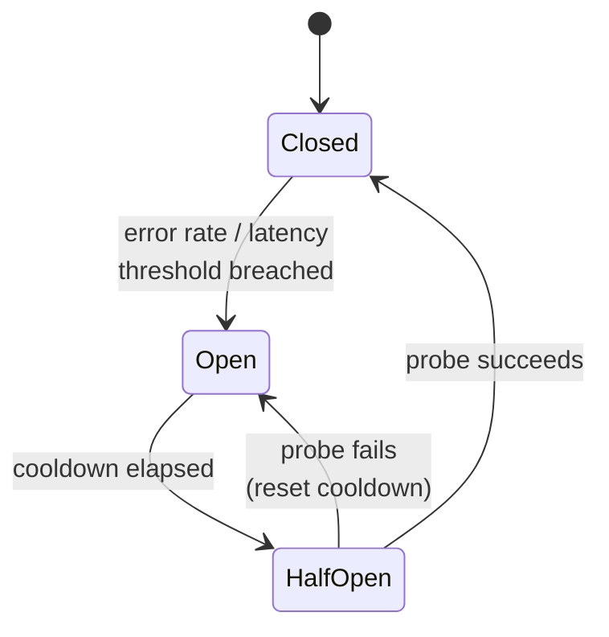

# Resilience four-pack: timeout, retry, circuit breaker, bulkhead

## 1. TL;DR

Four guards protect every service-to-service call: a **timeout** so you stop waiting, a **retry with jittered backoff** so a single packet drop doesn't fail the request, a **circuit breaker** so you stop hammering a sick dependency, a **bulkhead** so one sick dependency cannot drain the resources you need for the healthy ones. **They are not menu items** — each assumes the other three. The canonical failures (retry storm, zombie work, head-of-line blocking, false-positive trip) are all what happens when you ship one without the rest. Headline trade-off: **latency budget vs. blast-radius containment** — every guard you add costs tail latency and saves you from one specific way the system collapses under stress.

## 2. How it works

The four guards stack on every outbound call, in this order: bulkhead picks the resource pool, breaker decides whether to even try, timeout/deadline bounds the wait, retry handles transient failure on the way back. **Skip a layer and the next one inherits its failure mode.**

### Timeout

Every outbound call has a deadline. **Pick it from the dependency's tail latency**, not the mean — `p99 × 2` or `p99.9`, measured from the caller's side, so healthy calls never trip it. A timeout set to the mean rejects half of normal traffic the moment latency drifts.

Hard rule: **`client_timeout > server_timeout`** for the same hop. Otherwise the client gives up while the server is still computing — see "zombie work" below.

**Deadline propagation** is the half of timeouts that gets forgotten. The deadline travels with the request — gRPC `grpc-timeout` header, an explicit `Deadline` field, `context.Context` in Go, `CancellationToken` in .NET. Each hop sets its own timeout to `min(local_default, remaining_budget)`.

Walk the math through a four-hop chain. Edge enters with an 800 ms budget from the user. Auth burns 100 ms (700 ms left). Auth calls the user service with `min(local_default=2000ms, 700ms) = 700ms`; that call takes 200 ms (500 ms left). User service calls the profile DB with `min(1500ms, 500ms) = 500ms`. The DB returns in 50 ms; the chain unwinds in time. **Without propagation**, each hop uses its own 2000 ms default; the edge times out at 800 ms and returns 504, but the profile DB query keeps running for another 1.2 seconds, holding a connection nobody is waiting on. Multiply by 10k RPS and you've turned a slow request into a connection-pool exhaustion incident.

### Retry with backoff and jitter

Three knobs: **what** to retry, **how long** to wait, **how many times**.

Only retry on **retryable errors**: connection refused, TCP reset, read timeout, HTTP 5xx, HTTP 429 (with `Retry-After`), gRPC `UNAVAILABLE` / `DEADLINE_EXCEEDED`. **Never retry 4xx other than 429** — 400, 401, 403, 404, 422 mean the request is wrong, retrying produces the same error forever and burns deadline you'll need later.

Backoff is exponential — `base × 2^attempt`, e.g. 100, 200, 400, 800 ms. **Jitter is the operationally important part.** Without it, every client that failed at the same instant retries at the same instant, hits the recovering dependency in a synchronized wave, and knocks it over again — the **thundering herd**. Use **full jitter**:

```
sleep = random_uniform(0, base * 2 ** attempt)
```

The AWS SDK v3 default is decorrelated jitter, `sleep = random(base, prev_sleep * 3)` capped at a max — slightly better steady-state load shape, but full jitter is simpler and within a few percent. Bound the attempts to 2–4 and bound total wait against the request deadline, not just the per-attempt timeout.

Per-call attempt limits are the local guard. The system-level guard is a **retry budget**: cap the retry RPS to a fixed fraction of the success RPS over a rolling window — Envoy and the Google SRE book both default near 10%. **The point of the budget is not the steady state** (where 10% extra is harmless); it's that when failures spike to 100%, the budget mathematically caps retry amplification while the breaker's still in its evaluation window. Without it, every degradation gets a 3–4× load multiplier on the way down, exactly when the dependency can least afford it.

### Circuit breaker

A three-state machine in front of the dependency:



Trip on error rate (`> 50% errors over the last 20 calls`) or latency (`p99 > 2 s for 30 s`), but **only after a minimum request volume** in the window. resilience4j calls it `minimumNumberOfCalls`; Envoy gates outlier ejection on `enforcing_consecutive_5xx`. Without that floor, two failed calls in a quiet midnight window trip a 100% error rate and the breaker spends the cooldown returning errors against a perfectly healthy dependency.

Make the threshold concrete. Suppose normal error rate is 0.5%, p99 is 80 ms, and you serve 200 RPS. A reasonable trip rule is `error_rate > 20% AND volume >= 50 in 10s sliding window`, or `p99 > 250ms for 30s`. **A "wrong threshold" looks like** `error_rate > 5%` (trips during every minor blip and a noisy deploy), or `error_rate > 50%` with no volume floor (trips on 1 of 2 failed calls), or `p99 > 100ms` (trips on every routine GC pause). The instrument is `circuit_breaker_state_transitions` and `circuit_breaker_open_duration` — tune by replaying an outage from the metrics warehouse, not by feel.

While **open**, the breaker fails fast — no socket, no DNS lookup, no work. The caller sees an immediate `CircuitOpenException` instead of a held thread; that's [load shedding](backpressure-load-shedding.md) on a per-dependency axis. After the cooldown, move to **half-open** and allow exactly one probe (or a small ratio of traffic): success closes, failure re-opens with the cooldown reset.

### Bulkhead

Borrowed from ship design: **partition resources so a flood in one compartment doesn't sink the ship.** In code: per-dependency isolated pools — separate thread pools (Hystrix's original choice; gives you a thread boundary for free, costs a context switch), connection pools, or counting semaphores (resilience4j's default; cheaper, no extra context switch, but no isolation from the caller's stack).

Size each permit count from `concurrent_requests = RPS × p99_latency` plus headroom. A handler that calls payments, search, and recommendations might gate them at 50 / 100 / 30 permits — payments runs at 500 RPS × 80 ms ≈ 40 concurrent, search at 1k RPS × 80 ms ≈ 80, recommendations at 200 RPS × 120 ms ≈ 24. **Now recommendations slows from 120 ms to 5 s.** Concurrency demand jumps from 24 to ~1000; only its 30 permits fill, the 31st caller fails fast with `BulkheadFullException`. Payments and search keep flowing because they hold permits from different counters.

**Swap the numbers and the failure mode flips.** Give recommendations 100 permits and payments 30: recommendations now absorbs ~100 concurrent slow calls before shedding, which on a service with 200 worker threads means half your workers are blocked on recs, and payments at 30 permits starts queueing under normal load because its real demand was 40. The sizing isn't aesthetic; it's `RPS × p99_latency × safety_factor` per dependency, recomputed when traffic shape changes.

Without any bulkhead, every in-flight request to a slow dependency holds a worker thread. A service with 200 workers and one bad dependency stops accepting work for everyone — including healthy traffic for unrelated endpoints. **The bulkhead converts "one bad dependency" into "one degraded endpoint."**

## 3. When to use

Any **service-to-service** or **service-to-datastore** call — including calls to your own cache, database, or message broker. They can all be slow or sick; Redis can stall on AOF rewrite, Postgres can stall on autovacuum, Kafka can stall on a controller election.

Hard requirement: **any caller that retries must also have a circuit breaker and a bulkhead.** Retry without these is how you DDoS yourself the moment a dependency wobbles.

Anti-signal: **pure in-process function calls.** A timeout on `parse_json(s)` is theatre. A bulkhead around a hashmap lookup adds latency for no isolation gain. Save the four-pack for calls that cross a process or network boundary — that's where the failure modes live.

## 4. Trade-offs and failure modes

- **Retry without idempotency → duplicate side effects.** First attempt: `charge_card($50)` succeeds, response is lost in a network blip. Retry fires; the server has no memory of the first call and charges again. The customer's ledger now has two `-$50` entries. Fix is an `Idempotency-Key` plumbed end-to-end so the server returns the cached response for the second attempt. See [idempotency](idempotency.md).
- **Retry without a circuit breaker → retry storm.** Dependency degrades to 50% error rate; every caller retries 3 times; offered load becomes `1 + 0.5 + 0.25 + 0.125 = ~1.9×` baseline at the worst moment. The breaker converts "retry on transient failure" into "stop retrying once it's clearly not transient."
- **Circuit breaker on weak metrics → false-positive trips.** A 2-call window opens during normal dips. An absolute count (`> 10 errors`) trips during a deploy traffic spike where errors scale with traffic. **Instrument open/close events as first-class [observability](observability-trio.md) signals** — flapping breakers are louder than the failures they're trying to prevent.
- **Bulkhead too small → head-of-line blocking on the healthy path.** A 5-permit semaphore on a dependency that normally serves 50 concurrent calls means 45 callers per second wait, even when it's healthy.
- **Bulkhead too large → no isolation.** A 500-permit pool in a service with 600 worker threads means a slow dependency can hold 500/600 of your workers — protection on paper, none in practice.
- **Timeouts without deadline propagation → zombie work.** Edge times out at 1 s and returns 504; three hops down, a service is still computing the result, holding an open transaction, consuming a pooled connection, for a request nobody is reading. Repeat at 10k RPS and the connection pool is your bottleneck.
- **`client_timeout < server_timeout` → load amplifier.** Client gives up at 1 s; server happily keeps computing for 5 s. The client retries; now there are two server-side computations for one logical request. Either the client deadline strictly exceeds the downstream's worst case, or you propagate the deadline so the server can stop too.

## 5. Real-world and interviewer probes

**In the wild.** Netflix Hystrix popularized the four-pack as one library and **has been in maintenance mode since 2018** — the modern JVM default is **resilience4j** (functional, lighter weight, semaphore-based bulkheads). **Polly** is the .NET equivalent. Outside library land, the patterns are baked into platform primitives: gRPC deadlines, Go `context.Context`, Python `asyncio.timeout`, the **AWS SDK v3 retry strategy** ships with adaptive jittered backoff and a token-bucket retry budget by default — that's why `boto3` "just works" against a flaky DynamoDB. **Envoy** implements bulkheading via per-cluster connection limits, circuit-breaker-style outlier detection (eject a backend after N consecutive 5xx), and a first-class retry budget. Service meshes (Istio, Linkerd) push the four-pack out of application code into the sidecar — uniform policy across languages, but per-endpoint tuning becomes a YAML problem.

**Probes.**

- *"Why jitter?"* — Without it, every client that failed at the same instant retries at the same instant; the recovering dependency gets a synchronized wave and goes down again. Jitter spreads retries into a ramp instead of a wall.
- *"Walk me through circuit breaker states."* — Closed: traffic flows, breaker counts errors and latencies in a rolling window. Open on threshold breach: fail fast, run cooldown timer, no I/O. Half-open after cooldown: allow one probe (or a small traffic ratio); success → closed, failure → back to open with timer reset. The minimum-volume floor is the part candidates forget.
- *"What's the danger of retrying without idempotency?"* — Duplicate side effects. The server may have processed the first attempt and only the response was lost; the retry produces a second charge, a second order, a second email. Fix is an idempotency key plumbed end-to-end so the server dedupes retried writes.
- *"How do you pick a timeout?"* — Measure the dependency's tail latency from the caller's side, take `p99 × 2` or `p99.9`, cap by the caller's remaining deadline. It's a measurement, not a guess; re-measure after every traffic shape change.
- *"What if you only ship one of the four?"* — Each missing pillar has a named failure: no breaker → retry storm; no bulkhead → head-of-line blocking takes the whole service down; no deadline propagation → zombie work; no timeout → indefinite hangs. **The four-pack ships as a set because each one's failure mode is what the next one prevents.**
