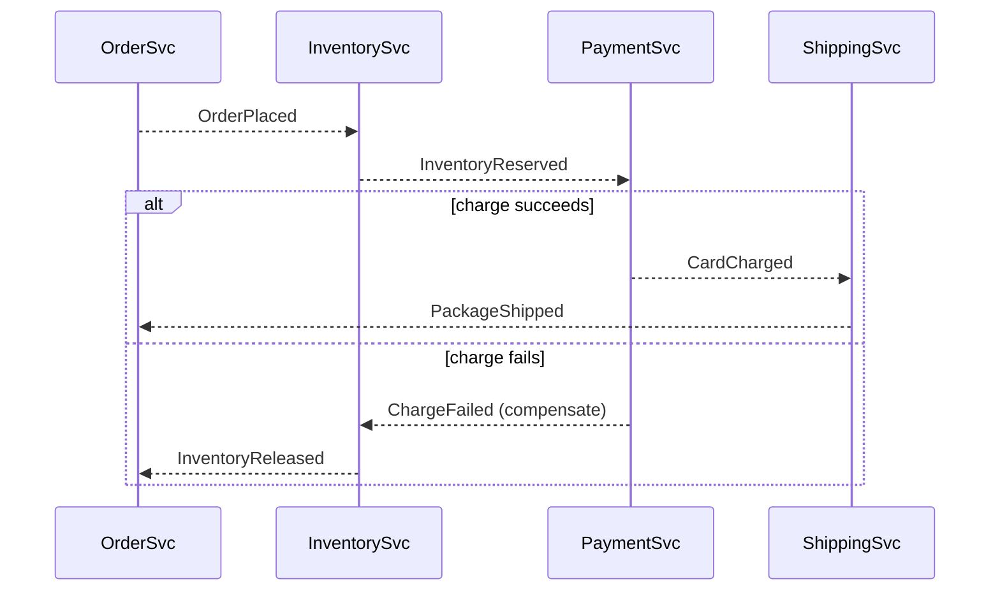
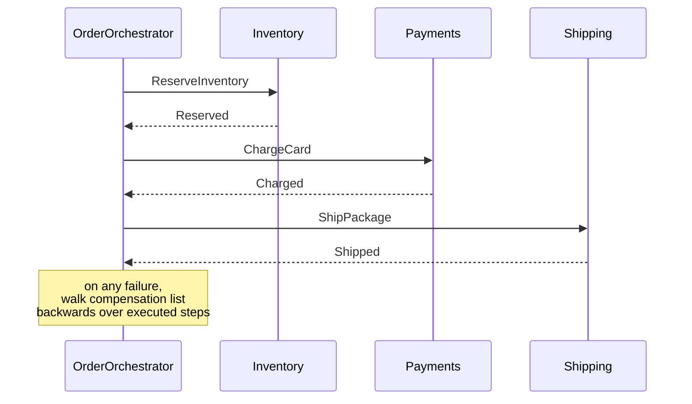

# Saga

## 1. TL;DR

A **saga** is a long-running business transaction split into a sequence of local steps across multiple services, where every forward step has a **compensating action** that semantically undoes it if a later step fails. It is the answer to "I need an atomic transaction across services" once you accept that two-phase commit (XA) across heterogeneous services is too expensive — which is almost always. You trade isolation for liveness: in-flight saga state is visible to readers, but the system stays available and partial failures resolve through compensation rather than locking the world.

## 2. How it works

Worked example throughout: an e-commerce order — **reserve inventory → charge card → ship → notify**. Four services, four local transactions, no shared database, no XA.

### Steps and compensations

Each forward step is a local transaction in one service's database. Each step defines a **compensating action** that undoes its effect *semantically* — not by rolling back the original txn, which already committed:

```
forward              compensation
ReserveInventory <-> ReleaseInventory
ChargeCard       <-> RefundCard
ShipPackage      <-> CancelShipment
SendNotification <-> (none — irreversible)
```

**Compensations are new business operations, not DB rollbacks.** A refund is a separate ledger entry, not an UNDO of the charge. They also do not always restore the pre-step world: a refund after capture differs from a void of an authorization (different fees, different timelines, different visibility on the customer's statement); releasing a reservation is cheap, but releasing inventory after `ShipPackage` already left the warehouse is impossible — the inventory is gone. **Treat compensations as their own first-class operations with their own preconditions and partial-success behavior, not as inverses.** The saga maintains the invariant "every executed forward step is either still committed or has been compensated" — eventually.

### Choreography

Services react to each other's events; no central coordinator. Order emits `OrderPlaced`, inventory emits `InventoryReserved`, payments emits `CardCharged`, shipping ships. On failure a service emits a `*Failed` event and upstream services listen for it to trigger their compensations.



**The trade-off is where the workflow lives.** Choreography spreads it across N services' event handlers; the saga has no home. Each service knows its own forward step and which events it reacts to, and that is all. Decoupled and simple per service, but the saga as a whole is **invisible** — no single place describes the workflow, "where is order 7421 stuck?" becomes archaeology across event logs and traces, and adding a step means changing event topologies in multiple services and deploying them in the right order. Choreography wins on coupling and loses on debuggability and change control.

### Orchestration

A dedicated **saga orchestrator** holds the workflow state and explicitly issues commands; services become step executors that handle commands and reply with success or failure.



The orchestrator owns the state machine ("reserved → charged → shipped → notified") and on failure walks the compensation list backwards over the steps that actually committed. **The workflow lives in one place.** That centralization is the entire point: one codebase to read when answering "what does this saga do?", one row to query when answering "where is order 7421?", one deploy to ship a step change. The cost is coupling — every participant takes commands from the orchestrator, and the orchestrator must know every participant's interface. **Orchestration pays for itself the moment a workflow has more than three or four steps or a non-trivial branch**, which is most real workflows.

### Semantic locks

No real locks across services. Services mark resources as **pending** until the saga commits or compensates: inventory sits in `RESERVED` (not `SOLD`), the card hold is `AUTHORIZED` (not `CAPTURED`), the order is `PROCESSING` (not `CONFIRMED`). Walk a concrete moment: order created, inventory reserved, payment charged, ship pending. A user query at this instant sees a partially-committed business state — order page shows "Processing", inventory page shows the SKU as one unit short, the customer's statement shows a pending authorization, no shipment exists yet. The UI's job is to render those states honestly ("Order received, preparing shipment") rather than lie to one of them. **Semantic locks are how each service tells the rest of the system "this resource is encumbered by an open saga; treat it as unavailable, but know it might still be released."** Other readers respect that state when deciding availability — and accept that some of their reads will see in-flight saga state that may be compensated away. This is the read-side cost of giving up isolation; see §4.

### Idempotent steps and compensations

Every step and every compensation gets retried (network, restart, redelivery). Both must be [**idempotent**](idempotency.md) — same `(saga_id, step)` produces the same effect on the second attempt as on the first. Dedup on the step key, store the result, return it on replay.

### Persistence

Orchestrator state must be durable. Crash mid-saga without persisted state and you cannot resume what you cannot remember — a half-charged, unshipped order with no refund sitting silently is the failure mode. Persist on every state transition, resume from the last persisted state on restart. Temporal makes this implicit (every workflow step is a durable checkpoint); hand-rolled orchestrators do it explicitly.

## 3. When to use

- **Multi-service business transactions** with eventual consistency: order placement, signup with provisioning, multi-account money movement, content publishing pipelines.
- **Replacing 2PC across heterogeneous services.** XA across a SQL database, a SaaS billing API, and a third-party shipping provider is not a real option; a saga is.
- **Workflows with human-in-the-loop steps.** Approvals, manual review, KYC checks. The workflow may pause for hours or days; real locks for that duration would kill the system. Sagas pause cheaply because they hold no locks.
- **Workflows with naturally compensating actions** in the domain — refunds, cancellations, releases.

Anti-signals:

- **Single-database transactions.** Use ACID. A saga inside one DB is theatre with worse semantics.
- **Workflows where partial states must never be observed.** A saga *will* expose intermediate state to readers. If that is unsafe — instantaneous all-or-nothing settlement — sagas are wrong; you need an ACID boundary.
- **Tight latency budgets** with synchronous request/response. Sagas are asynchronous by nature.

## 4. Trade-offs and failure modes

- **No isolation.** Other reads see in-flight saga state — inventory shows `RESERVED` items as unavailable even though the saga may compensate and release them. Designs need semantic locks or compensating reads. **ACID's "I" is the property you give up, and it is real money on the table** when two sagas race for the same scarce resource.
- **Compensations may not be possible.** "Send email" cannot be unsent. A webhook fired to a third party cannot be retracted. **A package that has left the warehouse cannot be unshipped** — the carrier will hand it to the customer regardless of what the saga thinks; "cancel shipment" is best-effort while the truck is moving and impossible after delivery. The cure is structural: **order steps so the irreversible one is last**, after every step that could fail. Once you reach it the saga is past its last decision point — by construction there is nothing left that can fail and force a compensation. Notification is last in the order example for exactly this reason; **if the irreversible step itself fails, treat it as a forward retry, never a saga rollback** — you do not refund the customer because the confirmation email bounced.
- **Compensation chains can fail.** A `RefundCard` the processor rejects leaves the saga half-compensated — inventory released, payment still captured, customer charged for nothing. The concrete failure mode: the card was canceled between charge and refund, and the processor returns "card not found." Now what? Compensations must be idempotent and retried with backoff, then **escalated to a human-handled queue when retries exhaust**. The operator's options for the canceled-card case are real-world: refund to the customer's stored bank account, issue store credit, or mail a check. **The saga's job is to fail loudly into a queue with full context, not to make the problem go away** — a refund the bank refuses is genuinely a person's problem and pretending otherwise hides money.
- **Choreography has no central state.** "Where did this saga get stuck?" becomes a distributed-tracing problem across N services. Orchestration trades coupling for one place to look.
- **Orchestrator is a SPOF if not HA.** Replicate it and persist state on every transition. **A single non-HA instance crashing mid-saga loses every in-flight workflow it owned** — exactly the failure mode the saga was meant to prevent.
- **Step delivery is a delivery-atomicity problem.** The orchestrator must publish "do step N" reliably even if it crashes between writing its state transition and publishing the command — the dual-write problem. **The answer is the [transactional outbox](outbox-cdc.md)**: persist the state transition and outbound command in one DB transaction, ship via CDC or a relay, dedup on `(saga_id, step)` at the handler.
- **2PC is a smell, not an alternative.** Walk what XA actually does. Phase one: the coordinator sends `PREPARE` to every participant; each participant writes the change durably, **acquires the row/page locks**, and replies "ready" — but does not release the locks. Phase two: the coordinator collects all "ready" votes, then sends `COMMIT` (or `ROLLBACK`); only on receipt does the participant release locks. The locks are held for **the entire round-trip across every participant**, which in a saga context means seconds at best and minutes-to-hours when human steps are involved. Contended rows serialize behind cross-service network latency and throughput collapses. Worse, a coordinator crash *between* `PREPARE` and `COMMIT` leaves participants **in-doubt**: locks held, transaction unresolvable without manual intervention, often by a DBA running `XA RECOVER` and guessing the right outcome. Third-party APIs (billing, shipping, notifications) don't speak XA at all, so the protocol cannot even cover the saga's actual participants. **Sagas trade isolation for liveness — the right trade in essentially every microservices context.**
- **Timeouts.** Every step needs a timeout and defined timeout behavior — usually "treat as failure, compensate," sometimes "escalate, do not auto-compensate" for irreversible steps. Without per-step timeouts, **a single stuck participant hangs the saga forever** and quietly fills the state table with zombies.
- **Versioning long-running sagas.** A three-day saga may outlive a deploy that changes its step set. **Either version sagas (V1 sagas finish on V1 code) or keep step changes backward compatible** — never deploy a step removal that strands in-flight workflows. Temporal makes this explicit with workflow versioning APIs; hand-rolled orchestrators discover it the hard way.

## 5. Real-world and interviewer probes

In the wild, **AWS Step Functions** is the dominant managed orchestration service on AWS, with compensation via `Catch` blocks. **Temporal** (forked from Uber's **Cadence** in 2019 by its original creators after they left Uber; both engines remain in active use, with Cadence still powering workflows at Uber) is the heavyweight durable orchestration engine: workflows are code, every step is a durable checkpoint, the runtime survives process failures transparently. **Netflix Conductor** and **Camunda** (BPMN) cover the same ground. Lighter-weight: a service-owned orchestrator on a database state table plus the outbox for command publication. Choreography-only sagas are common in smaller event-driven systems on Kafka.

Probes you should expect:

- *"Choreography or orchestration?"* — Orchestration unless the system is small and decoupling is paramount. Orchestration scales with workflow complexity; choreography turns "what does this saga do?" into archaeology across event logs.
- *"How do you handle a compensation that itself fails?"* — Idempotent, retried with backoff, escalated to an operator queue when retries exhaust. Some compensations (refund the processor refuses, shipment the carrier lost) genuinely require humans.
- *"Why is 2PC usually wrong here?"* — XA holds locks for the saga's duration, doesn't survive participant failure cleanly (in-doubt transactions strand resources), and third-party APIs don't speak XA anyway. Throughput collapses, availability craters.
- *"How do you guarantee the orchestrator's commands get delivered?"* — Outbox plus CDC for command messages, idempotent step handlers keyed on `(saga_id, step)`. State transition and outbound command commit together; the relay ships at-least-once; the handler dedups.
- *"What about isolation?"* — You don't get it. Mitigate with semantic locks, commutative operations, and compensating reads where it matters. If real isolation is non-negotiable, a saga is the wrong pattern.
- *"How do you order compensations under concurrent failures?"* — Reverse order of forward steps that *actually committed*. The orchestrator tracks executed steps (not planned ones) and walks that list backwards.
- *"How do you stop a saga from running forever?"* — Per-step timeouts plus a saga-level deadline, with defined timeout behavior per step. Without it, stuck steps fill the state table with zombies.
