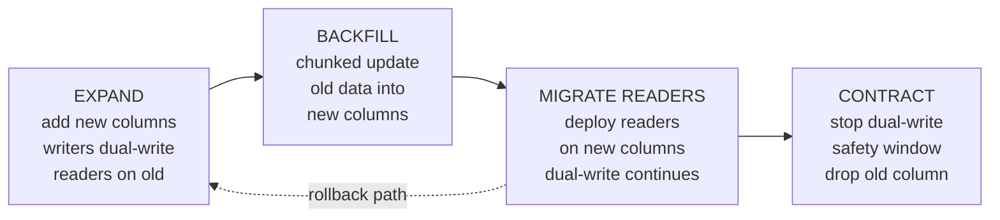

# Schema evolution

## 1. TL;DR

Long-lived data outlives the code that wrote it. A row written in 2019 is still in the table; an event published last quarter is still in the topic. **Schema evolution** lets new code read old data, old code read new data, and producers and consumers deploy on independent timelines without a global cutover. The core moves are small and unforgiving: only make backward-compatible field changes, never reuse a wire identifier, run **expand-contract** for any database migration that can't take downtime, put a schema registry in the path of producer deploys so breaking changes are rejected before they ship, and version events so consumers can branch on the format they're looking at.

## 2. How it works

Two surfaces evolve: **wire formats** (Protobuf, Avro, Thrift, JSON-with-a-contract) and **database schemas**. The rules differ; the spirit is the same — stage changes through a window where both shapes are valid.

### Compatibility flavors

The first thing to nail down on a given data path is which direction of compatibility you owe.

- **Backward:** new readers can read data written by old writers. The most common requirement — older data is always sitting around.
- **Forward:** old readers can read data written by new writers. Required when consumers and producers deploy out of order — the producer rolls out first and starts emitting the new shape before the consumer fleet has caught up. Avro and Protobuf readers tolerate unknown fields; JSON-with-a-strict-contract often doesn't, which is why "we'll just use JSON" tends to ship breakage.
- **Full:** both directions. The right default for any shared stream where producers and consumers deploy independently — almost any real Kafka topology with multiple teams.

### Wire format rules (Protobuf-shaped, but the principles port)

- **Add a field.** Optional, with a meaningful default. New writers populate it; old readers ignore it; old writers don't set it and new readers see the default. Safe.
- **Remove a field.** Two-step: deprecate first (stop reading it in code, leave it in the schema), wait until every reader is on a version that no longer requires it, *then* drop it from the schema and **reserve the field number**. The reservation is non-negotiable — see §4.
- **Rename a field.** Only the human-readable name changes; the field number / Avro fingerprint / Thrift tag is the wire identity, and the wire doesn't care what you call it in source.
- **Change a type.** Almost always breaking. The safe move is a *new* field with the new type, dual-write for a window, migrate readers, then deprecate the old field on the schedule above.
- **Required fields are forever.** A `required` field can never be safely removed (breaks old readers) or added (breaks old data). Modern Protobuf (proto3) removed `required` for exactly this reason. Avro has no `required` keyword at all — a field is required iff it has no default, so giving every field a sensible default is how you keep the schema evolvable. Use optional-with-default and validate in code.

### Expand-contract migrations (databases)

Any non-trivial DB migration on a live system runs in four phases. Worked example: changing `users.name TEXT` into `first_name` / `last_name`.



The illustrative SQL:

```
-- EXPAND
ALTER TABLE users
  ADD COLUMN first_name TEXT,
  ADD COLUMN last_name  TEXT;

-- BACKFILL (chunked, throttled, resumable; never one big UPDATE)
UPDATE users
   SET first_name = split_part(name, ' ', 1),
       last_name  = split_part(name, ' ', 2)
 WHERE id BETWEEN :lo AND :hi
   AND first_name IS NULL;

-- CONTRACT (after readers migrated and the safety window has passed)
ALTER TABLE users DROP COLUMN name;
```

The safety window between MIGRATE READERS and CONTRACT is the rollback path. Until you've sat in dual-write long enough that no in-flight code path still depends on `name`, dropping it turns a deploy regression into data loss. Rolling back from MIGRATE READERS is cheap (redeploy old code, dual-write was still running); rolling back from CONTRACT means restoring from backup.

### Schema registry

A **schema registry** holds every version of every schema and enforces a compatibility policy at registration time. Producers register the schema they intend to write under a *subject* (typically one per topic); the registry rejects registrations that break the subject's compatibility setting (`BACKWARD`, `FORWARD`, `FULL`, or the `_TRANSITIVE` variants that check against every prior version, not just the latest). Consumers fetch by schema ID and decode. The pre-deploy check is the value: a producer trying to ship a `required` field addition or a field-number reuse is stopped before it poisons the topic. Pick the mode deliberately — Confluent defaults to `BACKWARD`, which is fine for a single-consumer topic and quietly wrong for any topic where producers and consumers deploy independently.

### Versioned events

Every event payload carries an explicit schema version (a registry ID, an explicit `version: 3` field). Consumers branch on the version they're decoding. You must handle every version since the oldest unreplayed event in retention — and "unreplayed" includes "the projection rebuild we'll run six months from now."

```
on_event(evt):
    match evt.schema_version:
        case 1: handle_v1(evt)    # legacy, kept because old archive still exists
        case 2: handle_v2(evt)    # current
        case 3: handle_v3(evt)    # rolled out last week
```

The cost of carrying old branches is real but bounded; the cost of *not* carrying them is silently dropping or mis-projecting historical events.

## 3. When to use

- Any persisted data with a non-trivial lifetime — months, years. Database tables, event logs, archived blobs, anything restored from backup.
- Any [pub/sub stream](pubsub-semantics.md) with independent producers and consumers, especially across team boundaries.
- Any cross-team API where versions coexist on the wire — public APIs, internal RPCs, anything where "stop the world and upgrade everyone at once" isn't an option.
- Any system that supports replay or projection rebuilds — [CQRS read-side rebuilds](cqrs-read-models.md) force you to handle every historical event format.

Anti-signals:

- Ephemeral data with single-binary lifetime: in-process caches, in-memory state machines. Even there, careful — Redis dumps survive restarts, and dev/prod version skew can corrupt that "ephemeral" state.

## 4. Trade-offs and failure modes

- **Field number reuse is permanent silent corruption.** Reuse a Protobuf field number an old writer used for a `string` and a new writer uses for an `int32`, and an old reader will happily decode the int's bytes as a string and propagate garbage. No exception, no log line. **Reserve removed numbers** in the schema (`reserved 7;`) so the compiler refuses to let anyone reuse them.
- **Required fields are forever.** Removing one breaks every old reader; adding one breaks every old record. Default to optional with explicit defaults.
- **Default value mismatch.** If old and new code disagree on the default for a missing field, state diverges — old code writes a record without the field, new code reads it and applies its own default. Encode defaults in the schema so all readers agree.
- **Long-tail consumers.** An old consumer still running months after the schema changed reads new events with stale assumptions. Versioned events let you branch behavior; without versioning, the old consumer silently corrupts whatever projection it owns.
- **Replay across schema generations.** A projection rebuild replays every event since the beginning — across however many schema versions you've shipped. Deleting the v1 branch the day before someone runs the rebuild is the failure mode.
- **Big-bang migrations.** "Just drop the column and add the new one" works on a dev box and corrupts production. Without expand-contract you get downtime at best, lost rows at worst — old code mid-flight writes to a column the migration just dropped.
- **Schema registry as SPOF.** Every producer and every consumer hits the registry on the hot path. An outage stalls the pipeline. Cache aggressively by schema ID and treat registry availability as a tier-one dependency.

## 5. Real-world and interviewer probes

In the wild, **Confluent Schema Registry** is the dominant Kafka implementation, supporting Avro, Protobuf, and JSON Schema with per-subject compatibility policies (`BACKWARD`, `FORWARD`, `FULL`, plus `_TRANSITIVE` variants that enforce against every prior version, not just the latest). LinkedIn, where Kafka and Avro both originated, runs the largest deployment of the pattern. Google's **Protobuf style guide** codifies the field-number-reservation and never-reuse rules. Postgres `ALTER TABLE` semantics drove expand-contract into widespread practice — `ADD COLUMN ... NOT NULL DEFAULT <const>` rewrote the entire table on every release before PG11 (2018), which made non-volatile defaults a metadata-only operation. A volatile default (e.g. `DEFAULT random()`, `DEFAULT now()` on some versions) still triggers the rewrite, and adding a `CHECK` or `FOREIGN KEY` constraint without `NOT VALID` still scans the table — the lesson generalizes well past Postgres. **Stripe's API versioning by date** is the alternative shape: the caller pins a version (`Stripe-Version: 2024-10-01`), the server runs every request through a chain of version transformers. Different geometry, same goal.

Probes you should expect:

- *"Walk me through changing a column type without downtime."* — Expand-contract: add the new column, dual-write, backfill in chunks, deploy readers on the new column, sit in a safety window, drop the old column. The dual-write window is what gives you a rollback path.
- *"How do you safely remove a Protobuf field?"* — Mark deprecated, stop reading it, wait until every reader is on a build that doesn't need it, then remove it from the schema and **reserve the field number** so it can't be reused.
- *"Why is a schema registry useful?"* — Pre-deploy compatibility check: the producer's CI step that registers the new schema fails before the binary ships, instead of the breaking change reaching the topic. Also one source of truth for replay and processing tools that decode historical events.
- *"How do you handle replay across many schema versions?"* — Consumers branch by schema version and apply the right transformation per version. Old branches stay as long as old events exist in the source — projection rebuilds replay every format ever shipped.
- *"Why never reuse a field number?"* — Silent wire corruption. The wire identifies fields by number, not name. An old reader handed bytes the new writer intended for a different type at the same number decodes them under the old type — no exception, no log. Reserving the number tells the compiler to refuse.
- *"Backward, forward, or full?"* — Backward is the floor; full is the right default for shared streams. Forward-only is rare and usually a sign you really want full.
