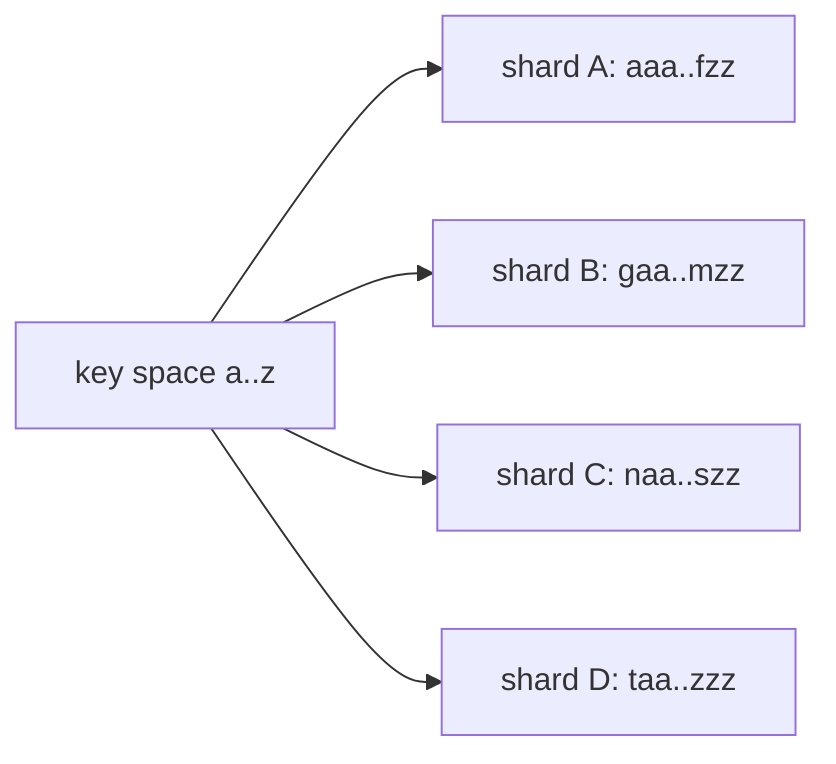

# Sharding

## 1. TL;DR

Sharding splits a dataset across N nodes so each holds a fraction — storage you couldn't fit on one box, or write throughput you couldn't push through one primary. **The strategy you pick (range, hash, directory) determines what's cheap, what's painful, and what wakes you up at 3am.** Once a system is sharded, two problems consume almost all the real engineering: **hot partitions** skewing load onto one node, and **resharding without downtime**. Everything else is incidental.

## 2. How it works

A shard is an independent slice — its own primary, replicas, backups. A *shard key* maps each row to one shard. A router (proxy, client library, or coordinator) **inspects the key on every query and dispatches to the right shard** before any real work happens. Two design choices dominate: how you draw the boundaries (range, hash, directory) and how you move them when N changes (resharding).

### Range sharding

The key space is partitioned into contiguous ranges; each range lives on one shard. The router holds a sorted list of `(range_start, shard)` tuples and binary-searches the key on every request.



**Range scans are cheap** — `WHERE created_at BETWEEN x AND y` hits at most two shards because the keys are physically adjacent. **The price is hot ranges**, and the canonical failure is shard-key-equals-timestamp. Pick `created_at` as the shard key on a 4-shard cluster: every new write goes to the shard owning `[now-ish, ∞)`. That shard sits at 100% CPU while the other three idle — **you've sharded into a single-shard system at the write tip**. Worse, the cold shards still cost you money. Spanner detects load (not just size) and splits a hot range in seconds, including very small but CPU-hot ranges; HBase splits only when a region exceeds `hbase.hregion.max.filesize`, so a small high-QPS range stays one region forever. Auto-split is a mitigation, not a fix — pick a key whose distribution matches your write pattern (hash the timestamp, or prefix with a high-cardinality field) instead of relying on the database to bail you out.

### Hash sharding

The shard for a key is `hash(key) mod N`, or equivalently a position on a [consistent-hashing ring](consistent-hashing.md).

```
shard(key) = hash(key) % N
```

**Distribution is even by construction.** The price is the inverse of range sharding: adjacent application keys become arbitrary points on different shards, and **any query that doesn't carry the shard key fans out to all N**. `WHERE created_at BETWEEN x AND y` on a 32-shard cluster becomes 32 parallel queries, a coordinator merge, and a sort — and **p99 is bounded by the slowest shard**, so one GC pause anywhere in the fleet shows up on every range query. Point lookups by primary key are fast; everything else costs you. With plain `mod N`, changing N reshuffles almost the entire dataset (`% 4` and `% 5` agree on roughly 1 key in 5); consistent hashing replaces `mod N` with a ring so that adding a shard moves only `~1/N` of the keys. The consistent-hashing topic covers virtual nodes.

### Directory-based sharding

A lookup table maps key (or key range, or tenant) to shard explicitly.

```
tenant_id  shard
---------  -----
acme       A
globex     B
initech    A
umbrella   C
```

Walk a request: a query arrives with `tenant_id=42`; the gateway looks up `42 → shard-7` in the directory; it opens (or reuses) a connection to shard-7 and forwards. **Every request pays a directory lookup before it does any real work.** In practice the directory is cached at every gateway with a short TTL or invalidated on layout change; the cold-cache lookup is one extra round-trip, the warm path is a hashmap hit. The directory itself has to be highly available — typically a small replicated store (etcd, ZooKeeper, a dedicated Postgres), or sharded by a hash if it's too large for one node — because **if the directory is down, nothing routes**.

**The payoff is per-tenant flexibility.** Move `tenant_id=42` from shard-7 to a dedicated shard-12 by updating one row (plus the data migration). Put your whale customer on its own hardware, pack the long tail of small tenants onto shared shards, isolate a noisy tenant in seconds. Hash and range sharding can't do this without redrawing boundaries for everyone.

### Resharding

Changing N triggers data movement. With `hash(key) mod N`, going from 4 to 5 shards changes almost every key's assignment — `% 4` and `% 5` agree on a small fraction. Consistent hashing was invented exactly here: adding a shard moves only the keys whose ring position falls into the new arc. Range and directory schemes change layout one range or one tenant at a time, naturally incremental.

The hard part isn't computing the new layout — it's executing the move while traffic flows. Splitting shard-4 into shard-4a/4b looks like:

1. **Dual-write.** Routing layer starts writing every shard-4-bound mutation to both old shard-4 and new shard-4a/4b (whichever the new key range says). Reads still go to shard-4. Acks wait on both writes; failure modes (one side down) fall back to write-then-replay.
2. **Backfill.** Stream shard-4's historical data to 4a/4b — snapshot plus a CDC tail to catch writes that happened during the snapshot. Vitess does this with VReplication; MongoDB's balancer migrates chunks; ad-hoc Postgres setups use logical replication or a custom dump-and-load.
3. **Verify.** Shadow-read: send the same key to old and new, compare results, alert on divergence. Run for hours to days until the divergence rate is zero.
4. **Read cutover.** Flip routing for the affected key range to 4a/4b. Keep dual-writes on so you can roll back.
5. **Stop dual-writing.** Once you trust the new shards, remove shard-4 from writes and decommission.

Each phase is **days to weeks at scale** because you're holding two copies of a moving target consistent. The dual-write window is the long pole: it's expensive (2× write traffic on the hot path), risky (both sides must stay consistent), and hard to abort cleanly. **Plan capacity so you reshard rarely** — every reshard buys back headroom, but only if you over-provision past the next growth horizon, not just past today.

### Hot-partition rescue

Three moves, in increasing order of intrusiveness:

- **Salt the key.** Take a celebrity follower-count counter at `followers:user_id=celeb_42`. Every fan write hashes the same key, lands on the same shard, and pegs it. Salt by appending a bucket: writes go to `followers:user_id=celeb_42#0` through `#15`, each fan picking a bucket at random. The 16 keys hash to (typically) 16 different shards — write load is now 16-way fanned out. **The cost is on reads**: getting the count is `SELECT SUM(c) FROM followers WHERE key IN (celeb_42#0, ..., celeb_42#15)`, a 16-way `UNION ALL`. So you salt only the keys that actually need it (whale tenants, viral content) and keep the cold tail on plain keys.
- **Introduce a secondary shard key.** If `user_id` alone is hot, shard on `(user_id, time_bucket)` or `(user_id, region)` so a single hot user's data spreads across shards by hour or region. Reads now have to carry the secondary component, which means redesigning query patterns.
- **Split the hot shard.** Move half its key range to a new shard. Range-sharded systems automate this (Spanner splits a hot range in seconds); hash systems want consistent hashing with virtual nodes so you can add capacity to the hot ring arc without redistributing the cold majority.

### Cross-shard queries

Any query that doesn't carry the shard key has to fan out:

- **Scatter-gather reads.** The coordinator sends to all N shards in parallel, waits for the last response, merges, and returns. **p99 is bounded by the slowest shard** — at N=32, you're effectively rolling 32 dice for tail latency on every query, and one slow GC pause anywhere shows up. Tail latency dominates and gets worse linearly with N.
- **Aggregations.** Sum, count, top-K need a coordinator merge. Approximate sketches (HyperLogLog, t-digest) ship per-shard partials that merge cheaply and stay accurate within a few percent; exact aggregations need every row and are expensive at scale.
- **Joins across shards.** **Co-located joins are fine** — if `orders` and `order_items` are both distributed on `customer_id`, every join key lives on one shard, and Citus/Vitess push the join down so each shard joins its local rows in parallel. **Non-co-located joins shuffle**: to join `orders` (sharded on `customer_id`) with `products` (sharded on `product_id`), the planner has to ship rows of one table to where the other lives, hash-join in memory, then merge — orders of magnitude slower than the co-located case. The pragmatic fix is to **duplicate small dimensions onto every shard** as reference tables (Citus does this explicitly) so joins against them are local. Design the schema so the hot path's joins are co-located; tolerate the shuffle only for analytics.

## 3. When to use

- **Data set too large for one node.** Storage exceeds what one machine holds, or write throughput exceeds what one primary sustains. **Read load alone is usually solved with [read replicas](replication.md), not sharding** — sharding is the answer for writes and storage, not reads.
- **Per-tenant isolation.** One tenant per shard — or a whale tenant on its own shard — eliminates the noisy-neighbor mode where one customer's bad query degrades everyone.
- **Geographic data locality.** Region-affinity sharding keeps EU users' data on EU shards (latency plus residency regimes like GDPR). The shard key is effectively `(region, user_id)`.
- **Write hotspots a single primary can't absorb.** Time-series ingest, event streams, activity feeds.

Anti-signals:

- **Small data, low write rate.** A 200 GB database doing 5k QPS does not need to be sharded. **Premature sharding is technical debt** that complicates every subsequent feature, schema migration, and join.
- **Strong cross-entity transaction requirements.** If you genuinely need ACID across many entities, sharding fights you. Consider whether a vertically-scaled primary plus read replicas gets you further before adopting sharding.
- **Aggregation-heavy analytics.** That's an OLAP problem. Use a columnar warehouse (Snowflake, BigQuery, ClickHouse), not a sharded OLTP store with scatter-gather.

## 4. Trade-offs and failure modes

- **Hot partition.** One shard at 90% CPU while others sit at 10%. **Capacity is the peak shard, not the average** — you pay for 10 shards while the system behaves like 1. Cluster averages hide this; per-shard CPU/QPS/p99 dashboards from day one are non-negotiable. Mitigate with key salting, secondary shard keys, or splitting the hot shard.
- **Cross-shard transactions.** Distributed transactions are hard, slow, and add coordination failure modes. **Two-phase commit across shards is rarely the right answer.** Pragmatic moves: choose the shard key so transactions stay within one shard, denormalize so the joined entities co-locate, or run a saga and accept eventual consistency.
- **Resharding cost.** Even with the dance above, the dual-write window is **weeks at scale** and the most expensive recurring operational task in a sharded system. Plan capacity past the next growth horizon, not just today, so you reshard rarely.
- **Skew on the shard key.** A "uniform" key that turns out non-uniform — a tenant-id scheme where one tenant is 40% of traffic. **Choose keys with high cardinality and uniform-ish distribution**; expect to revisit the choice once real traffic shape is known.
- **Secondary indexes.** Local indexes (per-shard) are cheap but require fan-out to query. Global indexes give single-query lookups but introduce a **second consistency problem** — the index lives on different shards from the data and must be kept in sync, usually asynchronously, so the index is briefly stale after writes.
- **Multi-tenant noisy neighbor.** One tenant's runaway query saturates its shard, taking out everyone co-located. Dedicate a shard to the noisy tenant, apply per-tenant quotas at the gateway, or isolate each tenant to its own database — directory sharding makes this cheap.
- **Operational multiplier.** N shards means N primaries, N replica sets, N backups, N upgrades, N restore drills. **Automation is non-negotiable past a handful of shards** — manual operations don't scale linearly with N, they scale worse.

## 5. Real-world and interviewer probes

In the wild:

- **Vitess** (built for YouTube's MySQL fleet) handles routing, resharding via VReplication (logical CDC stream from old shards to new), and scatter-gather on top of vanilla MySQL.
- **Citus** does the same for Postgres, with distributed query planning and reference tables broadcast to every worker for small joined dimensions; co-located joins on the distribution column run as pushed-down per-shard joins.
- **MongoDB sharded clusters** use range or hashed shard keys with `mongos` as the router and a config-server replica set as the directory; the balancer migrates chunks between shards when chunk size or shard imbalance crosses thresholds.
- **Cassandra** and **DynamoDB** hash the partition key onto a consistent-hashing ring; the partition key choice is the hot-partition surface, and DynamoDB's adaptive capacity (re-hosting hot partitions on dedicated capacity) is its hot-partition mitigation.
- **Spanner** uses range sharding with automatic split and merge driven by both size and load (a CPU-hot range gets split even if it's small), plus Paxos groups per range.
- **Snowflake-style ID generation** (Twitter Snowflake, ULID, KSUID) interleaves a worker/random component into the ID so concurrent writes don't all hash to the same shard or pile onto the last range — sharding-friendly IDs without giving up rough time ordering.

Probes:

- *"Range vs. hash sharding?"* — **Range when ordered scans are common** and you can tolerate hot ranges (or have auto-split). **Hash when even load is the priority** and queries reliably carry the shard key. The common production shape is both: hash on the partition key for distribution, plus a clustering key for in-shard ordering — the DynamoDB/Cassandra/Bigtable model.
- *"How do you reshard a live system without downtime?"* — Dual-write to old and new shards; backfill historical data via snapshot + CDC tail; shadow-read to verify divergence is zero; cut reads over; stop dual-writing; decommission. **Weeks at scale; the dual-write window is the long pole.**
- *"Walk me through hot-partition mitigation."* — Identify with per-shard CPU/QPS/p99/throttles. Short-term: salt the key (16-way fan-out for the offending row) or split the hot range. Long-term: redesign the shard key — add a time bucket, a region, or a higher-cardinality field. Verify on the same dashboards before and after; the metric should fall back to the cluster median.
- *"Query across multiple shards?"* — Scatter-gather and **accept p99 bounded by the slowest shard**, or denormalize so the query lives within one shard. Production systems denormalize the hot path and tolerate scatter-gather only for analytics.
- *"4 shards to 5 with `hash(key) % N`?"* — **Almost everything moves.** `% 4` and `% 5` agree on roughly 1 key in 5. That's why production systems use consistent hashing (adding a shard moves only `~1/N`) or directory-based schemes where the move is per-key explicit.
