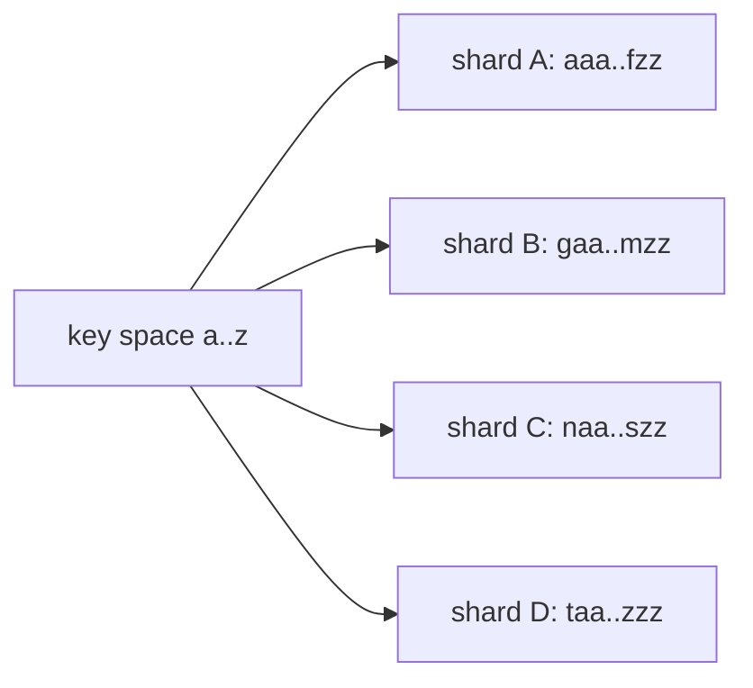

# Sharding

## 1. TL;DR

Sharding splits a dataset across N nodes so each holds a fraction — storage you couldn't fit on one box, or write throughput you couldn't push through one primary. The strategy you pick (range, hash, directory) determines what's cheap, what's painful, and what wakes you up at 3am. Two problems consume almost all the real engineering once a system is sharded: hot partitions skewing load onto one node, and resharding without downtime. Everything else is incidental.

## 2. How it works

A shard is an independent slice — its own primary, replicas, backups. A *shard key* maps each row to one shard. A router (proxy, client library, or coordinator) inspects the key on every query and dispatches to the right shard. The design choices are how you draw the boundaries and how you move them when N changes.

### Range sharding

The key space is partitioned into contiguous ranges; each range lives on one shard.



Range scans are cheap — keys near each other live on the same shard. The price is hot ranges. Alphabetical user IDs put every "Smith" sign-up on one shard. A monotonic timestamp puts every new write on the last shard while the others sit cold; you've sharded into a single-shard system at the write tip. Spanner and HBase auto-split when ranges get too large or too hot, which softens the problem but doesn't eliminate skew on the active range.

### Hash sharding

The shard for a key is `hash(key) mod N`, or equivalently a position on a [consistent-hashing ring](consistent-hashing.md).

```
shard(key) = hash(key) % N
```

Distribution is even by construction. The price is range scans: adjacent application keys become arbitrary points on different shards, so "orders between X and Y" becomes a scatter-gather. With plain `mod N`, changing N reshuffles almost the entire dataset; consistent hashing replaces `mod N` with a ring so that adding a shard moves only `~1/N` of the keys. The consistent-hashing topic goes deeper on virtual nodes.

### Directory-based sharding

A lookup table maps key (or key range, or tenant) to shard explicitly.

```
tenant_id  shard
---------  -----
acme       A
globex     B
initech    A
umbrella   C
```

Maximum flexibility: move a tenant by updating one row. Put a whale customer on a dedicated shard, pack the small customers onto a shared one. The price is that the directory becomes a critical dependency — cached aggressively, kept consistent with the actual layout, made highly available, because if it's down nothing routes.

### Resharding

Changing N triggers data movement. With `hash(key) mod N`, going from 4 to 5 shards changes almost every key's assignment. Consistent hashing was invented to fix this: adding a shard moves only the keys whose ring position falls into the new arc. Range and directory schemes change layout one range or one tenant at a time, naturally incremental.

### Hot-partition rescue

Three moves, in increasing order of intrusiveness:

- **Salt the key.** Append a bucket suffix per write so a hot logical key fans out across shards. A celebrity follower-count row written as `followers:celeb_id` becomes `followers:celeb_id:0` through `followers:celeb_id:15`; each increment picks a random bucket, reads sum across all 16. Cheap to add, but every read becomes a 16-way scatter-gather, so you only pay it on the keys that actually need it.
- **Introduce a secondary shard key.** If `user_id` is hot, shard on `(user_id, time_bucket)` or `(user_id, region)` so the hot tenant's data spreads across shards. Requires queries to carry the secondary component.
- **Split the hot shard.** Move half its key range to a new shard. Range-sharded systems automate this; hash systems want consistent hashing with virtual nodes so you can add capacity to the hot ring arc.

### Cross-shard queries

Any query that doesn't carry the shard key has to fan out:

- **Scatter-gather reads.** The coordinator sends to all shards and merges. Latency is bounded by the *slowest* shard — tail latency dominates as N grows.
- **Aggregations.** Sum, count, top-K need a coordinator merge. Approximate sketches (HyperLogLog, t-digest) ship per-shard partials and merge cheaply; exact aggregations are expensive at scale.
- **Joins across shards.** Don't, in general. Denormalize so joined fields live on one shard, or duplicate the small side onto every shard as a reference table. Co-located joins — both tables distributed on the same key — are fine in Citus and Vitess; non-co-located joins do a shuffle and are slow enough that you should design them out of the hot path.

## 3. When to use

- **Data set too large for one node.** Storage exceeds what one machine holds, or write throughput exceeds what one primary sustains. Read load alone is usually solved with [read replicas](replication.md), not sharding.
- **Per-tenant isolation.** One tenant per shard — or a whale tenant on its own shard — eliminates the noisy-neighbor mode where one customer's bad query degrades everyone.
- **Geographic data locality.** Region-affinity sharding keeps EU users' data on EU shards (latency plus residency regimes like GDPR). The shard key is effectively `(region, user_id)`.
- **Write hotspots a single primary can't absorb.** Time-series ingest, event streams, activity feeds.

Anti-signals:

- **Small data, low write rate.** A 200 GB database doing 5k QPS does not need to be sharded. Premature sharding is technical debt that complicates every subsequent feature.
- **Strong cross-entity transaction requirements.** If you genuinely need ACID across many entities, sharding fights you. Consider whether a vertically-scaled primary plus read replicas gets you further.
- **Aggregation-heavy analytics.** That's an OLAP problem. Use a columnar warehouse (Snowflake, BigQuery, ClickHouse), not a sharded OLTP store with scatter-gather.

## 4. Trade-offs and failure modes

- **Hot partition.** One shard at 90% CPU while others sit at 10%. Capacity is the *peak* shard, not the average — you pay for 10 shards while the system behaves like 1. Monitor per-shard metrics from day one; cluster averages hide this. Mitigate with key salting, secondary shard keys, or splitting.
- **Cross-shard transaction loss.** Distributed transactions are hard, slow, and add coordination failure modes. Pragmatic answers: choose the shard key so transactions stay within one shard, denormalize so data is co-located, or use a saga and accept eventual consistency. Two-phase commit across shards is rarely the right answer.
- **Resharding without downtime.** Dual-write to old and new; backfill from a snapshot or CDC stream; verify; cut reads over; stop writing to old; drop. Takes weeks at scale and is the most expensive operational task in a sharded system. Plan capacity early so you don't reshard often.
- **Skew on the shard key.** A "uniform" key that turns out non-uniform at scale — a tenant-id scheme where one tenant is 40% of traffic. Choose keys with high cardinality and uniform-ish distribution; expect to revisit the choice.
- **Secondary indexes.** Local indexes (per-shard) are cheap to maintain but require fan-out to query. Global indexes give single-query lookups but introduce a second consistency problem — the index lives on different shards and must be kept in sync.
- **Multi-tenant noisy neighbor.** One tenant's runaway query saturates its shard, taking out everyone co-located. Mitigations: dedicate a shard to the noisy tenant, apply per-tenant quotas, or isolate each tenant to its own database.
- **Operational multiplier.** N shards means N primaries, N replica sets, N backups, N upgrades, N restore drills. Automation is non-negotiable past a handful of shards.

## 5. Real-world and interviewer probes

In the wild:

- **Vitess** (built for YouTube's MySQL fleet) handles routing, resharding via VReplication (logical CDC stream from old shards to new), and scatter-gather on top of vanilla MySQL.
- **Citus** does the same for Postgres, with distributed query planning and reference tables broadcast to every worker for small joined dimensions; co-located joins on the distribution column run as pushed-down per-shard joins.
- **MongoDB sharded clusters** use range or hashed shard keys with `mongos` as the router and a config-server replica set as the directory; the balancer migrates chunks between shards when chunk size or shard imbalance crosses thresholds.
- **Cassandra** and **DynamoDB** hash the partition key onto a consistent-hashing ring; the partition key choice is the hot-partition surface, and DynamoDB's adaptive capacity (re-hosting hot partitions on dedicated capacity) is its hot-partition mitigation.
- **Spanner** uses range sharding with automatic split and merge driven by both size and load (a CPU-hot range gets split even if it's small), plus Paxos groups per range.
- **Snowflake-style ID generation** (Twitter Snowflake, ULID, KSUID) interleaves a worker/random component into the ID so concurrent writes don't all hash to the same shard or pile onto the last range — sharding-friendly IDs without giving up rough time ordering.

Probes:

- *"Range vs. hash sharding?"* — Range when ordered scans are common and you can tolerate hot ranges (or have auto-split). Hash when even load is the priority and queries carry the shard key. For both, you end up with hash on the partition key plus a clustering key for in-shard ordering — the DynamoDB/Cassandra shape.
- *"How do you reshard a live system without downtime?"* — Stand up the new layout. Dual-write old and new. Backfill from a snapshot or CDC stream. Verify with shadow-read comparisons. Cut reads over. Stop writing to old. Drop. Weeks at scale; the dual-write window is the long pole.
- *"Walk me through hot-partition mitigation."* — Identify with per-shard metrics (CPU, QPS, p99, throttles). Short-term: salt the key or split the hot range. Long-term: redesign the shard key — add a time bucket, a region, or a higher-cardinality field. Verify on the same dashboards before and after.
- *"Query across multiple shards?"* — Scatter-gather it and accept p99 bounded by the slowest shard, or denormalize so the query lives within one shard. Production systems denormalize hot paths and tolerate scatter-gather only for analytics.
- *"4 shards to 5 with `hash(key) % N`?"* — Almost everything moves. `% 4` and `% 5` agree on a small fraction of keys. That's why production systems use consistent hashing (adding a shard moves only `~1/N`) or directory-based schemes where the move is per-key explicit.
