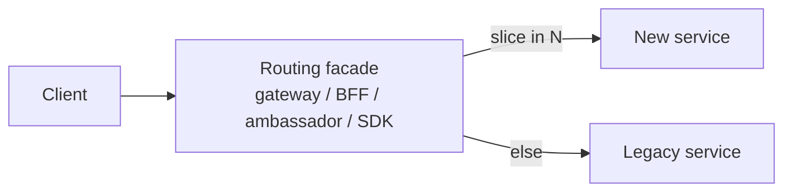

# Strangler fig

## 1. TL;DR

The **strangler fig** pattern incrementally replaces a legacy system by routing slices of its traffic to a new system, one slice at a time, until the legacy is starved of work and can be removed. The name comes from the strangler-fig vine that grows around a host tree until the host dies inside the lattice — there is no big-bang cutover and no maintenance window; the old system keeps serving production while a new system grows beside it. This is the default playbook for any non-trivial migration. The part most teams get wrong is not the routing scaffolding but actually finishing: a strangler that never decommissions the legacy is just two production systems forever.

## 2. How it works

Six recurring moves. None are exotic; the value is doing them in order and not skipping the last one.

### Routing facade

The make-or-break component. A proxy sits in front of legacy and decides per-request whether to route to legacy or to new:

The facade can live anywhere a request passes through: an API gateway, a BFF, an ambassador sidecar, an SDK shim, or a feature flag inside the legacy itself. What matters is that it can pattern-match on something stable — endpoint, tenant, cohort, header, percentage — and that the rules are versioned, observable, and reversible. Treat the facade as a first-class production system; this is where outages will happen.

### Slice the system

Identify a bounded surface that can be moved on its own: one endpoint, one feature, one tenant cohort, one record type. The smaller the slice, the less risk per cutover and the faster you learn whether the new system works under production load. The first slice is a probe, not a milestone — pick one with high enough volume to give signal but low enough blast radius that a rollback is cheap.

### Read slice first

Where you can, start with read-only paths. Reads are easier to validate (you have a known correct answer from legacy), failures are non-destructive, and you can shadow the new system without touching production state.

### Dual-run / shadow mode

Before flipping traffic, run the new system *alongside* the legacy. The facade fans the request to both, but only the legacy response is returned; the new system's response is logged and compared. This catches behavioral drift — null handling, timezone offsets, edge cases baked into legacy that nobody documented — before any user notices. Shadowing is the single highest-leverage de-risking step in a strangler migration.

### Cutover

Flip the routing rule for the slice: the facade now serves it from the new system. Keep the legacy code path warm — same data, same deploy — for a safety window so you can roll back without cold-starting it.

### Backfill data ownership

If the data lived in the legacy database, decide who owns the write path during and after the slice cuts over. During shadow, legacy still owns writes — the new system's write path is exercised only against a parallel store or discarded after comparison; never let two systems commit to the canonical store unobserved. After cutover, three common shapes:

- **New owns writes; legacy reads via [CDC](outbox-cdc.md)** until legacy callers are also migrated.
- **Legacy owns writes; new reads via CDC** — useful when you can't yet trust new on the write path.
- **Dual-write.** Both systems write, one is declared source of truth. Simple to describe, painful to operate — the two writes can disagree and the reconciliation logic is its own subsystem. CDC-driven flows are usually safer.

### Decommission

When no traffic has flowed through the legacy code path for a defined safety window, delete it. Delete the routing rule, delete the service, delete the table. This is the step that turns a one-year migration into a five-year zombie when skipped.

## 3. When to use

- **Replacing any production system that can't be turned off** — most of them. If a maintenance window isn't an option, you're doing a strangler whether you call it that or not.
- **Untangling a monolith into services.** Each extracted service is a strangled slice; the facade is usually the monolith's edge router or a gateway in front of it.
- **Database migration.** Postgres to Spanner, MySQL to Vitess, Oracle to anything. The strangler runs at the query layer: a data-access shim routes per table or per tenant, often coordinated with CDC for backfill.
- **Cloud migration.** On-prem to cloud, one slice at a time, with the facade typically at the edge LB or DNS layer.

Anti-signals:

- **Greenfield projects.** No legacy to strangle. Naming a regular rollout "strangler" is cargo-culting.
- **Systems small enough for a maintenance-window swap.** If the whole system fits a one-hour cutover with a tested rollback, the strangler scaffolding is more expensive than the swap.
- **Truly stateless components.** Just deploy the replacement behind the same address and let traffic shift via normal rollout.

## 4. Trade-offs and failure modes

- **Two systems running in parallel = double cost.** Operational, monetary, and cognitive — on-call covers both, telemetry covers both, every change has to consider both. Finite if you finish; ruinous if you don't.
- **Data ownership ambiguity.** Mid-migration, "which system is source of truth for this record?" must have one answer at any point in time. Document it, enforce it in the facade, version the answer per slice. Ambiguity here is how you get silent data divergence.
- **Routing logic complexity grows.** The facade's "legacy or new?" rules accumulate per slice, per tenant, per region. Without discipline to delete rules as slices stabilize, the facade becomes a second legacy.
- **Forgotten dead code in legacy.** "We cut over years ago but the old code is still here, and no one's sure what calls it." The most common strangler failure: the decommission step is implicit and gets deprioritized the moment the new system works. Budget it explicitly — calendar it, assign it, treat it as part of "done."
- **Behavioral drift.** Old assumptions baked into legacy (timezone defaults, null vs empty string, rounding modes, undocumented sort order) won't be replicated unless you find them. Shadow comparisons are how you find them; do not skip shadowing because the new system "looks right."
- [**Schema coupling**](schema-evolution.md)**.** If both systems share a database, schema changes affect both, and you can't truly migrate. A meaningful strangler usually has to include a database split — as a prerequisite or as part of the slice work.
- **Rollback cost.** If you cut over and roll back, in-flight writes to the new system may be lost or have to be reconciled to the legacy store. Each slice needs an explicit rollback plan: where do the in-flight writes go, and is loss acceptable?

## 5. Real-world and interviewer probes

In the wild: Stripe's payments-platform migration extracted slices behind a routing layer over years; Shopify's monolith decomposition extracted "components" one at a time using a similar facade pattern; Amazon S3's early evolution fronted older storage with a strangler-style layer. Practically every published cloud-migration writeup describes the same shape under different names. The canonical reference is Martin Fowler's "Strangler Fig Application" article, which named the pattern.

Probes you should expect:

- *"How do you pick the first slice?"* — Smallest, lowest-risk, ideally read-only, with enough volume to give real signal. Its job is to validate the routing facade and the team's process, not to deliver business value.
- *"How do you handle data during migration?"* — One source of truth per record per phase. CDC or an outbox keeps the non-owning side in sync. Avoid dual-write unless consistency requirements permit it; if you must dual-write, name the source of truth and treat the other write as best-effort.
- *"What if you need to roll back mid-cutover?"* — Flip the facade rule back to legacy. In-flight writes that landed in the new system are reconciled to legacy via the same CDC channel, or accepted as bounded loss for low-stakes writes. Rollback cost is part of the slice's design, not an afterthought.
- *"When is the strangler the wrong choice?"* — When a maintenance window swap is cheaper than the routing scaffolding, when the system is truly stateless, or when the team won't have the runway to finish the decommission step. A half-finished strangler is worse than a done big-bang.
- *"What's the most common failure of strangler projects?"* — Never finishing the decommission. The new system serves traffic, the legacy lingers indefinitely, and the team carries two production systems forever. The fix is process, not technology: treat decommission as a first-class phase with its own definition of done.
- *"Why is the routing facade the make-or-break component?"* — It's the only place that knows the migration's truth: which slice belongs to which system, when, for whom. If the facade is buggy, slow, or unobservable, the migration is buggy, slow, and unobservable. Build it like a production system, not like a script.
