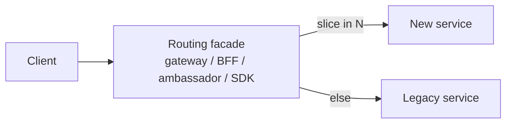

# Strangler fig

## 1. TL;DR

The **strangler fig** pattern incrementally replaces a legacy system by routing slices of its traffic to a new system, one slice at a time, until the legacy is starved of work and can be removed. The name comes from the strangler-fig vine that grows around a host tree until the host dies inside the lattice — there is no big-bang cutover and no maintenance window; the old system keeps serving production while a new system grows beside it. **This is the default playbook for any non-trivial migration.** The part most teams get wrong isn't the routing scaffolding — it's finishing. **A strangler that never decommissions the legacy is just two production systems forever.**

## 2. How it works

A handful of recurring moves. None are exotic; the value is doing them in order and not skipping the last one.

### Routing facade

**The make-or-break component.** It owns three things: routing decisions, traffic safety, and rollback control. Every other piece of the migration is downstream of it:

Walk one request. A `GET /api/orders/12345` arrives at the gateway. The facade evaluates rules in order: does the path match an active slice? Does the tenant fall in the pilot cohort? Does the percentage roll-the-dice land in-bucket? On the first match it forwards to the new service; otherwise it falls through to legacy. Concrete rules look like `path =~ ^/api/v2/orders/` → new, or `tenant_id in pilot_cohort_2026q2` → new, or `hash(user_id) % 100 < 5` → new (a 5% canary). **The facade pattern-matches on something stable — endpoint, tenant, cohort, header, percentage — never on something the client controls and the new system also reads, or you'll loop.**

The facade can live anywhere a request passes through: an API gateway, a BFF, an ambassador sidecar, an SDK shim, or a feature flag inside the legacy itself. **Non-negotiable properties: rules are versioned, observable per-rule, and reversible in seconds — not a redeploy.** Reversibility is what makes the canary plan real; if rolling back means a CI cycle, you don't have a rollback plan, you have a hope. Treat the facade as a first-class production system; this is where outages will happen and this is where they get contained.

### Slice the system

A slice is a bounded surface that moves on its own: one endpoint, one feature, one tenant cohort, one record type. **The first slice's job is to validate the facade and the team's process — not to ship business value.** Pick something with enough traffic to give real signal in hours, not weeks, and small enough blast radius that a rollback costs nothing.

The canonical first slice is a read-only `GET /products/{id}`. It is the smallest, lowest-risk surface in the system: failures don't corrupt data, the legacy is still the authority, you have a known-correct answer to validate against, and if the new service misbehaves you kill it and rebuild cheaply. Avoid a write path or a multi-step workflow for slice one; you don't yet know if the routing facade, the new service's deploy pipeline, and your observability are wired correctly, and you don't want to find out under a write load.

### Dual-run / shadow mode

Walk it concretely. Every request in the slice goes to legacy *and* to new in parallel. Legacy's response is what the user sees; new's response is logged, then compared field-by-field with legacy's and any diff is written to a discrepancy log. **The user is never exposed to new's behavior in shadow mode — only to its load.** A team typically runs shadow for weeks before any cutover: long enough to see month-end batch jobs, daylight-savings transitions, the long-tail of edge cases that don't appear in the first few days.

What shadowing catches that nothing else does: timezone defaults, null vs empty string, rounding modes, undocumented sort order, error codes that legacy returned with a body that some downstream parses for a reason no one remembers. **Shadow comparisons surface assumptions that nobody knew were assumptions.** Skipping shadow because "the new service looks right in staging" is the most common cause of post-cutover incidents that take a week to root-cause.

A cheap shadow rig is a fan-out in the facade plus a comparator job that reads both response logs by request ID and emits a structured diff. The comparator's tolerance rules — what counts as a benign difference — are themselves a deliverable; expect to iterate on them.

### Cutover

Cutover is not a flip; it's a phased ramp with rollback at every step.

- **Phase 1 — 1% canary.** Facade routes 1% of slice traffic to new (real responses now, not shadow). Watch error rate, p50/p99 latency, and a small set of business metrics tied to the slice (orders/min, payment success rate, whatever the slice owns). Hold for hours-to-days depending on volume; you need enough samples to distinguish real signal from noise.
- **Phase 2 — 10%.** Same metrics, longer hold. This phase typically surfaces capacity issues: connection pools, downstream rate limits, cache behavior under realistic miss rates.
- **Phase 3 — 50%.** Both systems now carry comparable load. This is when shared-resource contention — the same database, the same cache, the same downstream — becomes visible.
- **Phase 4 — 100%.** New owns the slice. Legacy code path stays warm — same data wired in, same deploy still rolling — for a defined safety window (commonly a week to a month) so a rollback doesn't have to cold-start it.

**Rollback at every phase is flipping the routing rule, not a redeploy.** That is the entire reason the facade exists. Each phase has explicit go/no-go criteria written *before* it starts; ad-hoc judgement during a ramp is how teams talk themselves into ignoring early signal.

### Backfill data ownership

**Exactly one system owns the canonical write at any time, per slice, per phase. Documenting this explicitly is what prevents data corruption.** During shadow, legacy owns writes; new's write path is exercised only against a parallel store or discarded after comparison. Letting two systems commit to the canonical store unobserved is how silent divergence starts.

After cutover, the three common shapes:

- **New owns writes; legacy reads via [CDC](outbox-cdc.md)** until legacy callers are also migrated. Most common when new is the long-term home.
- **Legacy owns writes; new reads via CDC** — useful when you can't yet trust new on the write path, or when legacy has triggers/stored-procs you haven't ported.
- **Dual-write.** Both systems write, one is declared source of truth. Simple to describe, painful to operate — the two writes can disagree, fail independently, and the reconciliation logic is its own subsystem. CDC-driven flows are almost always safer.

The worst case to anticipate: legacy DB owns `orders` and someone proposes "new service owns `orders` too, both write." Don't. Pick one canonical writer per slice, write it down in the facade-rule comment, and route reads through CDC for the other side.

### Decommission

Walk the failure mode. Cutover ships, the new system carries 100% of traffic, the legacy is "ready to delete." Three years later, legacy still runs. A nightly cron in there does something. The original team has left. Nobody is sure what's safe to remove, so nobody removes anything. The migration is "done" and the org is paying for two production systems forever.

**Most strangler projects fail at decommission, not cutover.** The cutover step has a deadline because it has visible risk; decommission has invisible risk and no deadline, so it slips indefinitely. The fix is process, not technology:

- **The decommission ticket is part of the cutover plan, with a calendar deadline.** Not "after the safety window" — a date.
- **An owner is named on the cutover ticket, not the migration ticket.** Migration owners rotate off; cutover owners are the ones who know what's safe.
- **Decommission means delete: the routing rule, the service, the deploy, the database, the IAM, the alerts, the dashboards, the runbook entries.** A half-decommissioned system is the zombie.
- **Audit "who calls legacy?" with traffic data, not memory.** If the safety window passes with zero traffic on the legacy code path, that is the evidence; if there is non-zero traffic, find the caller and migrate them before deleting.

## 3. When to use

- **Replacing any production system that can't be turned off** — most of them. If a maintenance window isn't an option, you're doing a strangler whether you call it that or not.
- **Untangling a monolith into services.** Each extracted service is a strangled slice; the facade is usually the monolith's edge router or a gateway in front of it.
- **Database migration.** Postgres to Spanner, MySQL to Vitess, Oracle to anything. The strangler runs at the query layer: a data-access shim routes per table or per tenant, often coordinated with CDC for backfill.
- **Cloud migration.** On-prem to cloud, one slice at a time, with the facade typically at the edge LB or DNS layer.

Anti-signals:

- **Greenfield projects.** No legacy to strangle. Naming a regular rollout "strangler" is cargo-culting.
- **Systems small enough for a maintenance-window swap.** If the whole system fits a one-hour cutover with a tested rollback, the strangler scaffolding is more expensive than the swap.
- **Truly stateless components.** Just deploy the replacement behind the same address and let traffic shift via normal rollout.

## 4. Trade-offs and failure modes

- **Two systems running in parallel = double cost.** Operational, monetary, and cognitive — on-call covers both, telemetry covers both, every change has to consider both. Finite if you finish; ruinous if you don't.
- **Data ownership ambiguity.** Mid-migration, "which system is source of truth for this record?" must have one answer at any point in time. Document it, enforce it in the facade, version the answer per slice. Ambiguity here is how you get silent data divergence.
- **Routing logic complexity grows.** The facade's "legacy or new?" rules accumulate per slice, per tenant, per region. Without discipline to delete rules as slices stabilize, the facade becomes a second legacy.
- **Forgotten dead code in legacy.** "We cut over years ago but the old code is still here, and no one's sure what calls it." The most common strangler failure: the decommission step is implicit and gets deprioritized the moment the new system works. Budget it explicitly — calendar it, assign it, treat it as part of "done."
- **Behavioral drift.** Old assumptions baked into legacy (timezone defaults, null vs empty string, rounding modes, undocumented sort order) won't be replicated unless you find them. Shadow comparisons are how you find them; do not skip shadowing because the new system "looks right."
- [**Schema coupling**](schema-evolution.md)**.** If both systems share a database, schema changes affect both, and you can't truly migrate. A meaningful strangler usually has to include a database split — as a prerequisite or as part of the slice work.
- **Rollback cost.** If you cut over and roll back, in-flight writes to the new system may be lost or have to be reconciled to the legacy store. Each slice needs an explicit rollback plan: where do the in-flight writes go, and is loss acceptable?

## 5. Real-world and interviewer probes

In the wild: Stripe's payments-platform migration extracted slices behind a routing layer over years; Shopify's monolith decomposition extracted "components" one at a time using a similar facade pattern; Amazon S3's early evolution fronted older storage with a strangler-style layer. Practically every published cloud-migration writeup describes the same shape under different names. The canonical reference is Martin Fowler's "Strangler Fig Application" article, which named the pattern.

Probes you should expect:

- *"How do you pick the first slice?"* — Smallest, lowest-risk, ideally read-only, with enough volume to give real signal. Its job is to validate the routing facade and the team's process, not to deliver business value.
- *"How do you handle data during migration?"* — One source of truth per record per phase. CDC or an outbox keeps the non-owning side in sync. Avoid dual-write unless consistency requirements permit it; if you must dual-write, name the source of truth and treat the other write as best-effort.
- *"What if you need to roll back mid-cutover?"* — Flip the facade rule back to legacy. In-flight writes that landed in the new system are reconciled to legacy via the same CDC channel, or accepted as bounded loss for low-stakes writes. Rollback cost is part of the slice's design, not an afterthought.
- *"When is the strangler the wrong choice?"* — When a maintenance window swap is cheaper than the routing scaffolding, when the system is truly stateless, or when the team won't have the runway to finish the decommission step. A half-finished strangler is worse than a done big-bang.
- *"What's the most common failure of strangler projects?"* — Never finishing the decommission. The new system serves traffic, the legacy lingers indefinitely, and the team carries two production systems forever. The fix is process, not technology: treat decommission as a first-class phase with its own definition of done.
- *"Why is the routing facade the make-or-break component?"* — It's the only place that knows the migration's truth: which slice belongs to which system, when, for whom. If the facade is buggy, slow, or unobservable, the migration is buggy, slow, and unobservable. Build it like a production system, not like a script.
